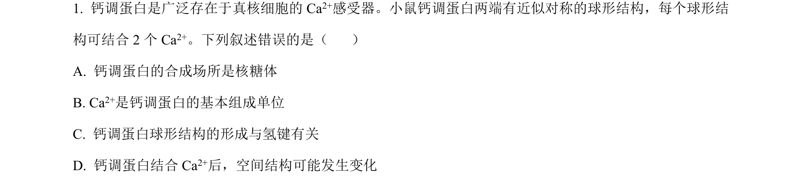
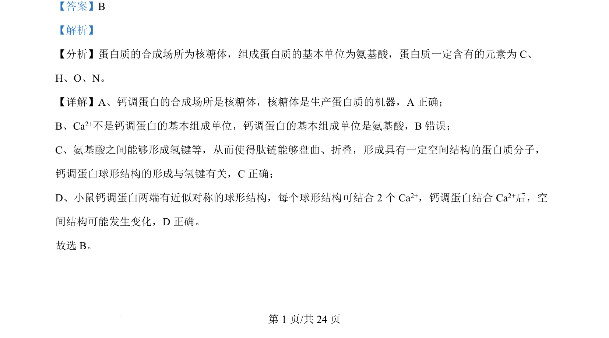

## 题面

## 摘要

本题考察蛋白质的结构和组成，包括合成场所、基本单位、氢键与空间结构变化。

## 关联考点

- [[134-蛋白质|蛋白质]]
- [[510-氨基酸|氨基酸]]
- [[435-氢键|氢键]]
- [[669-空间结构|空间结构]]

## 答案与解析

> 📄 原 PDF 第 1 页：`素材/真题/吉林/2008-2024·（吉林）生物高考真题/2024年高考生物试卷（辽宁）（解析卷）.pdf`
