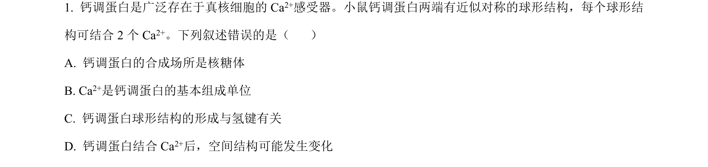
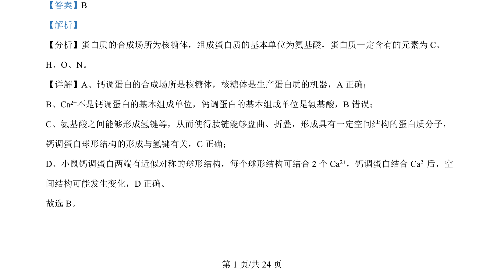

## 题面

## 摘要

本题考察蛋白质的结构和组成，包括合成场所、基本单位、氢键与空间结构变化。

## 关联考点

- [[134-蛋白质|蛋白质]]
- [[510-氨基酸|氨基酸]]
- [[435-氢键|氢键]]
- [[669-空间结构|空间结构]]

## 答案与解析

> 📄 原 PDF 第 1 页：`素材/真题/吉林/2008-2024·（吉林）生物高考真题/2024年高考生物试卷（辽宁）（解析卷）.pdf`

<!-- 题干文本-start -->
## 题干文本
1. 钙调蛋白是广泛存在于真核细胞的Ca 2+感受器。小鼠钙调蛋白两端有近似对称的球形结构，每个球形结
构可结合2个Ca 2+。下列叙述错误的是（    ）
A. 钙调蛋白的合成场所是核糖体
B. Ca2+是钙调蛋白的基本组成单位
C. 钙调蛋白球形结构的形成与氢键有关
D. 钙调蛋白结合 Ca2+后，空间结构可能发生变化
<!-- 题干文本-end -->

<!-- 解析文本-start -->
## 解析文本
【答案】B
【解析】
【分析】蛋白质的合成场所为核糖体，组成蛋白质的基本单位为氨基酸，蛋白质一定含有的元素为 C、
H、O、N。
【详解】A、钙调蛋白的合成场所是核糖体，核糖体是生产蛋白质的机器，A 正确；
B、Ca2+不是钙调蛋白的基本组成单位，钙调蛋白的基本组成单位是氨基酸，B错误；
C、氨基酸之间能够形成氢键等，从而使得肽链能够盘曲、折叠，形成具有一定空间结构的蛋白质分子，
钙调蛋白球形结构的形成与氢键有关，C正确；
D、小鼠钙调蛋白两端有近似对称的球形结构，每个球形结构可结合 2 个 Ca2+，钙调蛋白结合 Ca2+后，空
间结构可能发生变化，D 正确。
故选 B。
<!-- 解析文本-end -->
