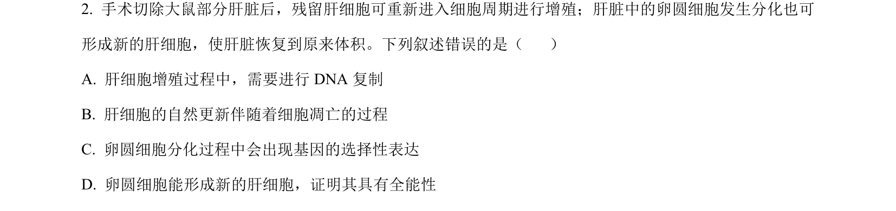
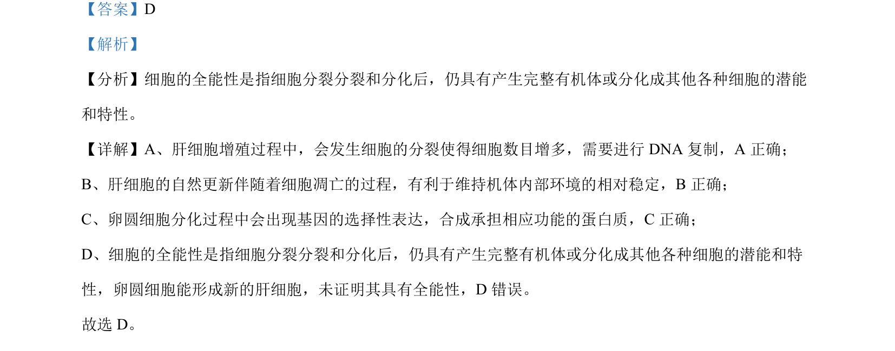

## 题面

## 摘要

该题考查细胞增殖、凋亡、分化及全能性等基本概念辨析

## 关联考点

- [[584-增殖|细胞增殖]]
- [[285-DNA复制|DNA复制]]
- [[250-细胞凋亡|细胞凋亡]]
- [[583-基因选择性表达|基因选择性表达]]
- [[249-细胞全能性|细胞全能性]]

## 答案与解析

> 📄 原 PDF 第 2 页：`素材/真题/吉林/2008-2024·（吉林）生物高考真题/2024年高考生物试卷（辽宁）（解析卷）.pdf`
