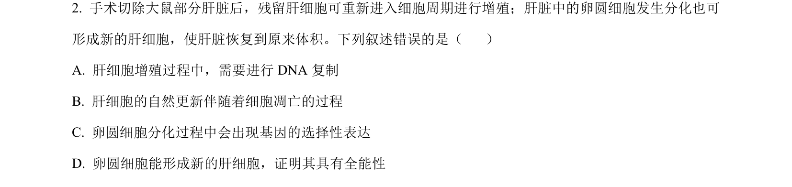
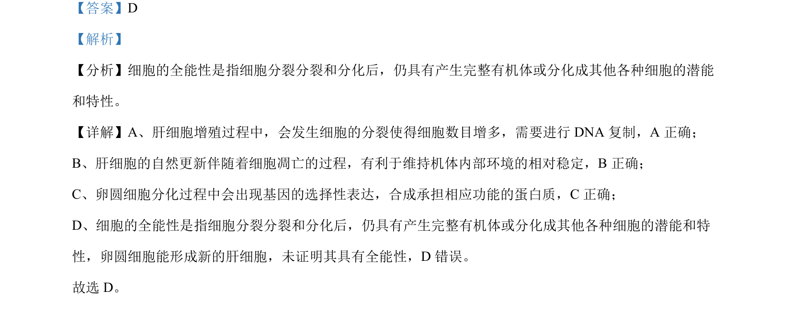

## 题面

## 摘要

该题考查细胞增殖、凋亡、分化及全能性等基本概念辨析

## 关联考点

- [[584-增殖|细胞增殖]]
- [[285-DNA复制|DNA复制]]
- [[250-细胞凋亡|细胞凋亡]]
- [[583-基因选择性表达|基因选择性表达]]
- [[249-细胞全能性|细胞全能性]]

## 答案与解析

> 📄 原 PDF 第 2 页：`素材/真题/吉林/2008-2024·（吉林）生物高考真题/2024年高考生物试卷（辽宁）（解析卷）.pdf`

<!-- 题干文本-start -->
## 题干文本
2. 手术切除大鼠部分肝脏后，残留肝细胞可重新进入细胞周期进行增殖；肝脏中的卵圆细胞发生分化也可
形成新的肝细胞，使肝脏恢复到原来体积。下列叙述错误的是（    ）
A. 肝细胞增殖过程中，需要进行 DNA 复制
B. 肝细胞的自然更新伴随着细胞凋亡的过程
C. 卵圆细胞分化过程中会出现基因的选择性表达
D. 卵圆细胞能形成新的肝细胞，证明其具有全能性
<!-- 题干文本-end -->

<!-- 解析文本-start -->
## 解析文本
【答案】D
【解析】
【分析】细胞的全能性是指细胞分裂分裂和分化后，仍具有产生完整有机体或分化成其他各种细胞的潜能
和特性。
【详解】A、肝细胞增殖过程中，会发生细胞的分裂使得细胞数目增多，需要进行 DNA 复制，A 正确；
B、肝细胞的自然更新伴随着细胞凋亡的过程，有利于维持机体内部环境的相对稳定，B正确；
C、卵圆细胞分化过程中会出现基因的选择性表达，合成承担相应功能的蛋白质，C正确；
D、细胞的全能性是指细胞分裂分裂和分化后，仍具有产生完整有机体或分化成其他各种细胞的潜能和特
性，卵圆细胞能形成新的肝细胞，未证明其具有全能性，D 错误。
故选 D。
<!-- 解析文本-end -->
