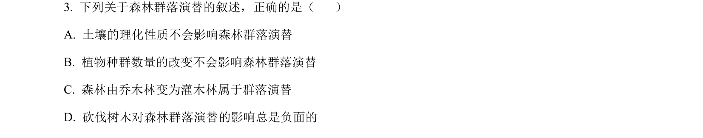
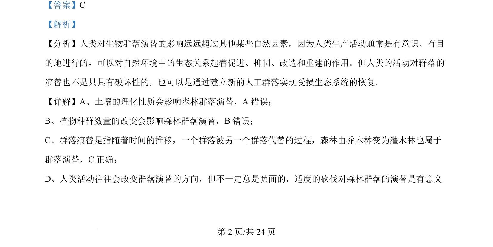

## 题面

## 摘要

该题考查森林群落演替的概念及影响因素，判断正确叙述。

## 关联考点

- [[407-群落演替|群落演替]]
- [[467-人类活动对演替的影响|人类活动对演替的影响]]

## 答案与解析

> 📄 原 PDF 第 2 页：`素材/真题/吉林/2008-2024·（吉林）生物高考真题/2024年高考生物试卷（辽宁）（解析卷）.pdf`

<!-- 题干文本-start -->
## 题干文本
3. 下列关于森林群落演替的叙述，正确的是（    ）
A. 土壤的理化性质不会影响森林群落演替
B. 植物种群数量的改变不会影响森林群落演替
C. 森林由乔木林变为灌木林属于群落演替
D. 砍伐树木对森林群落演替的影响总是负面的
<!-- 题干文本-end -->

<!-- 解析文本-start -->
## 解析文本
【答案】C
【解析】
【分析】人类对生物群落演替的影响远远超过其他某些自然因素，因为人类生产活动通常是有意识、有目
的地进行的，可以对自然环境中的生态关系起着促进、抑制、改造和重建的作用。但人类的活动对群落的
演替也不是只具有破坏性的，也可以是通过建立新的人工群落实现受损生态系统的恢复。
【详解】A、土壤的理化性质会影响森林群落演替，A 错误；
B、植物种群数量的改变会影响森林群落演替，B错误；
C、群落演替是指随着时间的推移，一个群落被另一个群落代替的过程，森林由乔木林变为灌木林也属于
群落演替，C正确；
D、人类活动往往会改变群落演替的方向，但不一定总是负面的，适度的砍伐对森林群落的演替是有意义
<!-- 解析文本-end -->
