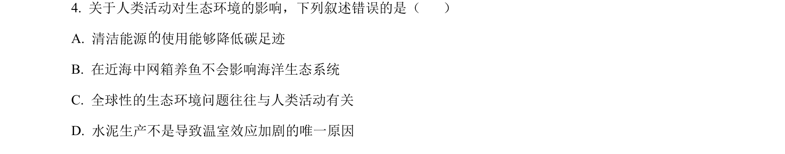
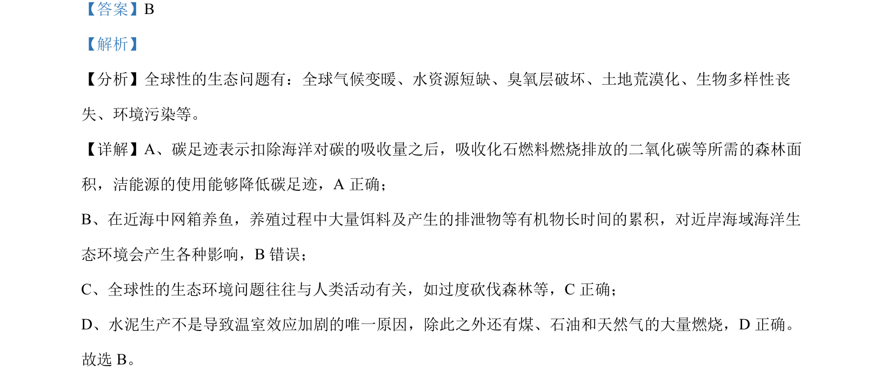

## 题面

## 摘要

该题考查人类活动对生态环境的影响及温室效应相关生态问题。

## 关联考点

- [[769-碳足迹|碳足迹]]
- [[627-海洋生态系统|海洋生态系统]]
- [[195-能源与环境|温室效应]]

## 答案与解析

> 📄 原 PDF 第 3 页：`素材/真题/吉林/2008-2024·（吉林）生物高考真题/2024年高考生物试卷（辽宁）（解析卷）.pdf`

<!-- 题干文本-start -->
## 题干文本
4. 关于人类活动对生态环境的影响，下列叙述错误的是（    ）
A. 清洁能源 使用能够降低碳足迹
B. 在近海中网箱养鱼不会影响海洋生态系统
C. 全球性的生态环境问题往往与人类活动有关
D. 水泥生产不是导致温室效应加剧的唯一原因
<!-- 题干文本-end -->

<!-- 解析文本-start -->
## 解析文本
【答案】B
【解析】
【分析】全球性的生态问题有：全球气候变暖、水资源短缺、臭氧层破坏、土地荒漠化、生物多样性丧
失、环境污染等。
【详解】A、碳足迹表示扣除海洋对碳的吸收量之后，吸收化石燃料燃烧排放的二氧化碳等所需的森林面
积，洁能源的使用能够降低碳足迹，A 正确；
B、在近海中网箱养鱼，养殖过程中大量饵料及产生的排泄物等有机物长时间的累积，对近岸海域海洋生
态环境会产生各种影响，B错误；
C、全球性的生态环境问题往往与人类活动有关，如过度砍伐森林等，C正确；
D、水泥生产不是导致温室效应加剧的唯一原因，除此之外还有煤、石油和天然气的大量燃烧，D 正确。
故选 B。
<!-- 解析文本-end -->
