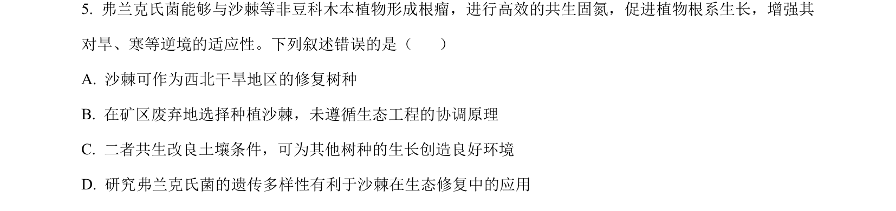
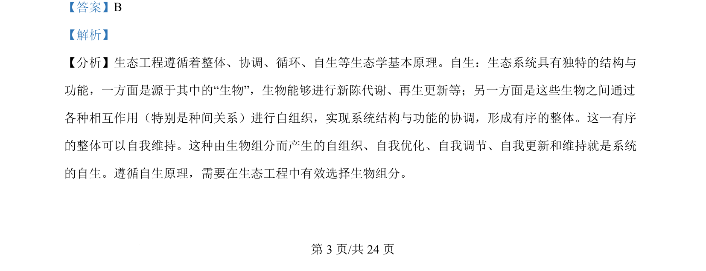
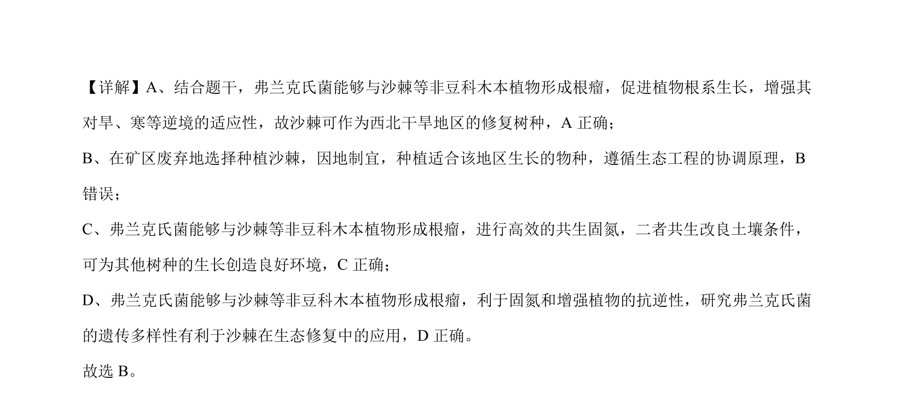

## 题面

## 摘要

沙棘与弗兰克氏菌共生固氮及生态修复应用，考查生态工程协调原理。

## 关联考点

- [[753-共生固氮|共生固氮]]
- [[768-生态工程协调原理|生态工程协调原理]]
- [[398-生态修复|生态修复]]
- [[022-生物因素|种间关系]]

## 答案与解析

> 📄 原 PDF 第 3 页：`素材/真题/吉林/2008-2024·（吉林）生物高考真题/2024年高考生物试卷（辽宁）（解析卷）.pdf`

<!-- 题干文本-start -->
## 题干文本
5. 弗兰克氏菌能够与沙棘等非豆科木本植物形成根瘤，进行高效的共生固氮，促进植物根系生长，增强其
对旱、寒等逆境的适应性。下列叙述错误的是（    ）
A. 沙棘可作为西北干旱地区的修复树种
B. 在矿区废弃地选择种植沙棘，未遵循生态工程的协调原理
C. 二者共生改良土壤条件，可为其他树种的生长创造良好环境
D. 研究弗兰克氏菌的遗传多样性有利于沙棘在生态修复中的应用
<!-- 题干文本-end -->

<!-- 解析文本-start -->
## 解析文本
【答案】B
【解析】
【分析】生态工程遵循着整体、协调、循环、自生等生态学基本原理。自生：生态系统具有独特的结构与
功能，一方面是源于其中的“生物”，生物能够进行新陈代谢、再生更新等；另一方面是这些生物之间通过
各种相互作用（特别是种间关系）进行自组织，实现系统结构与功能的协调，形成有序的整体。这一有序
的整体可以自我维持。这种由生物组分而产生的自组织、自我优化、自我调节、自我更新和维持就是系统
的自生。遵循自生原理，需要在生态工程中有效选择生物组分。
的
<!-- 解析文本-end -->
