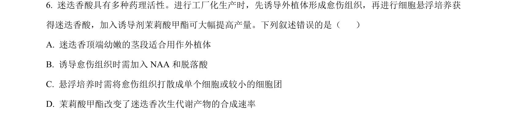
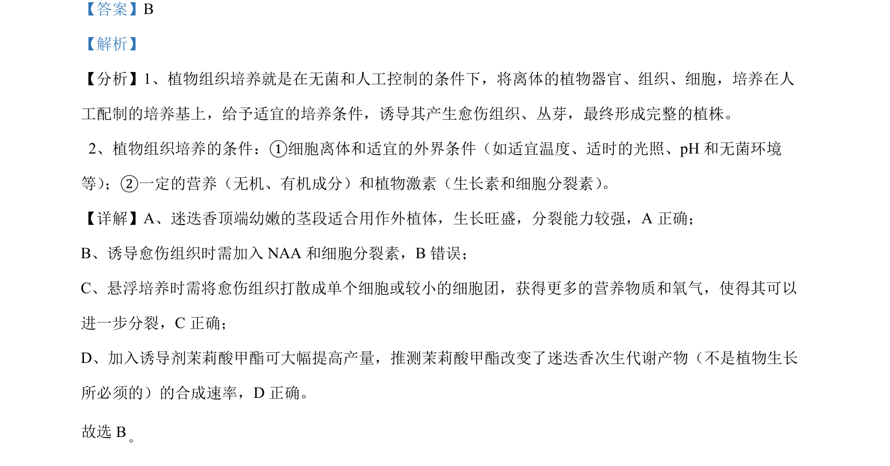

## 题面

## 摘要

该题结合植物组织培养技术，考查外植体选择、激素使用、悬浮培养步骤及次生代谢调控。

## 关联考点

- [[437-植物组织培养|植物组织培养]]
- [[435-愈伤组织|愈伤组织]]
- [[悬浮培养]]
- [[次生代谢产物]]

## 答案与解析

> 📄 原 PDF 第 4 页：`素材/真题/吉林/2008-2024·（吉林）生物高考真题/2024年高考生物试卷（辽宁）（解析卷）.pdf`
