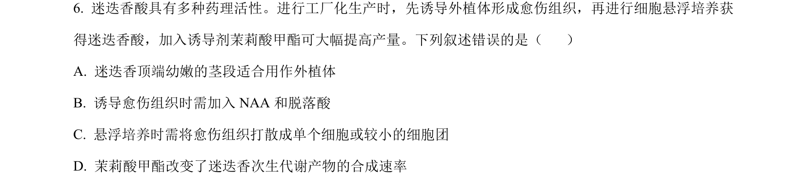
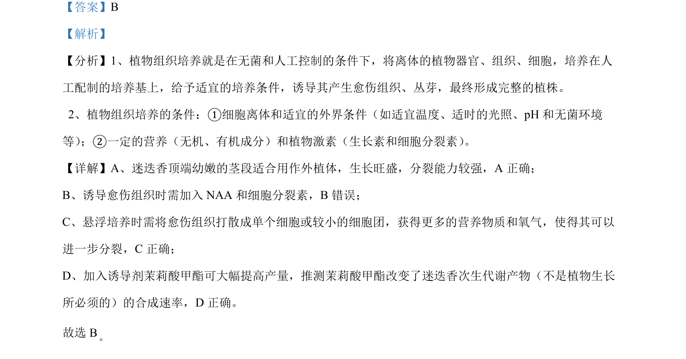

## 题面

## 摘要

该题结合植物组织培养技术，考查外植体选择、激素使用、悬浮培养步骤及次生代谢调控。

## 关联考点

- [[437-植物组织培养|植物组织培养]]
- [[435-愈伤组织|愈伤组织]]
- [[814-悬浮培养|悬浮培养]]
- [[621-次生代谢产物|次生代谢产物]]

## 答案与解析

> 📄 原 PDF 第 4 页：`素材/真题/吉林/2008-2024·（吉林）生物高考真题/2024年高考生物试卷（辽宁）（解析卷）.pdf`

<!-- 题干文本-start -->
## 题干文本
6. 迷迭香酸具有多种药理活性。进行工厂化生产时，先诱导外植体形成愈伤组织，再进行细胞悬浮培养获
得迷迭香酸，加入诱导剂茉莉酸甲酯可大幅提高产量。下列叙述错误的是（    ）
A. 迷迭香顶端幼嫩的茎段适合用作外植体
B. 诱导愈伤组织时需加入 NAA 和脱落酸
C. 悬浮培养时需将愈伤组织打散成单个细胞或较小的细胞团
D. 茉莉酸甲酯改变了迷迭香次生代谢产物的合成速率
<!-- 题干文本-end -->

<!-- 解析文本-start -->
## 解析文本
【答案】B
【解析】
【分析】1、植物组织培养就是在无菌和人工控制的条件下，将离体的植物器官、组织、细胞，培养在人
工配制的培养基上，给予适宜的培养条件，诱导其产生愈伤组织、丛芽，最终形成完整的植株。
 2 、植物组织培养的条件：①细胞离体和适宜的外界条件（如适宜温度、适时的光照、pH 和无菌环境
等） ；②一定的营养（无机、有机成分）和植物激素（生长素和细胞分裂素） 。
【详解】A、迷迭香顶端幼嫩的茎段适合用作外植体，生长旺盛，分裂能力较强，A 正确；
B、诱导愈伤组织时需加入 NAA 和细胞分裂素，B错误；
C、悬浮培养时需将愈伤组织打散成单个细胞或较小的细胞团，获得更多的营养物质和氧气，使得其可以
进一步分裂，C正确；
D、加入诱导剂茉莉酸甲酯可大幅提高产量，推测茉莉酸甲酯改变了迷迭香次生代谢产物（不是植物生长
所必须的）的合成速率，D 正确。
故选 B
<!-- 解析文本-end -->
