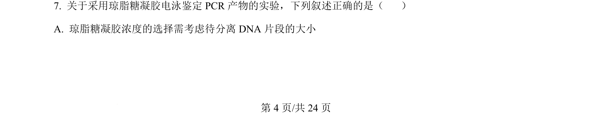
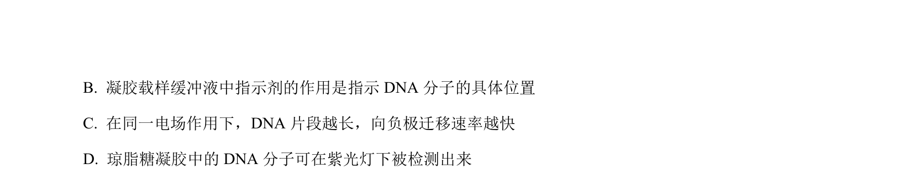
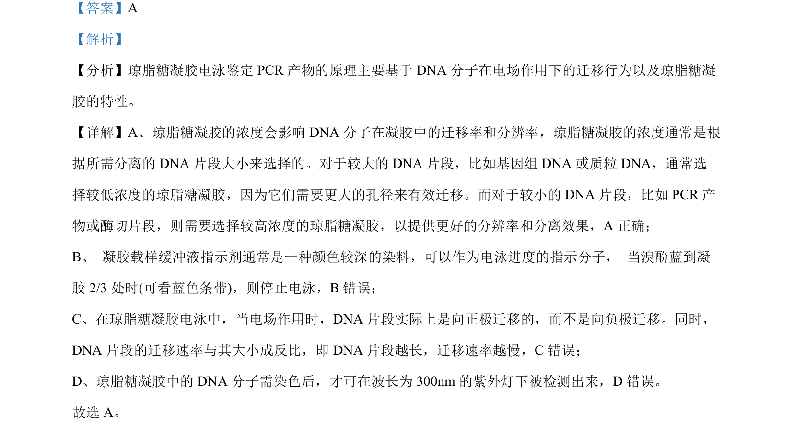

## 题面

## 摘要

考查琼脂糖凝胶电泳鉴定PCR产物的原理及操作要点

## 关联考点

- [[774-琼脂糖凝胶电泳|琼脂糖凝胶电泳]]
- [[743-DNA迁移率|DNA迁移率]]
- [[528-PCR产物鉴定|PCR产物鉴定]]
- [[470-凝胶浓度|凝胶浓度]]

## 答案与解析

> 📄 原 PDF 第 4 页：`素材/真题/吉林/2008-2024·（吉林）生物高考真题/2024年高考生物试卷（辽宁）（解析卷）.pdf`
