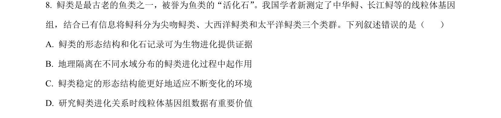
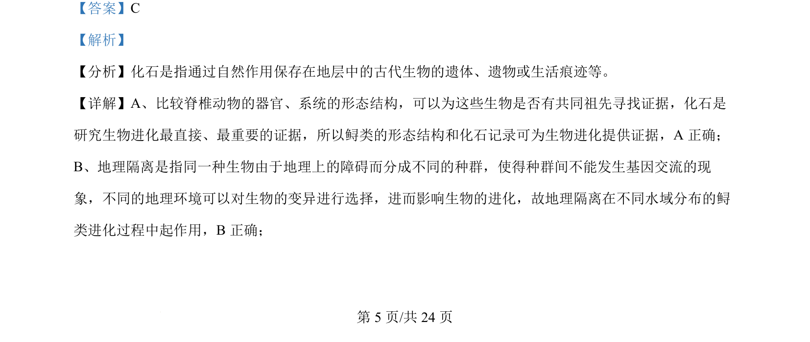
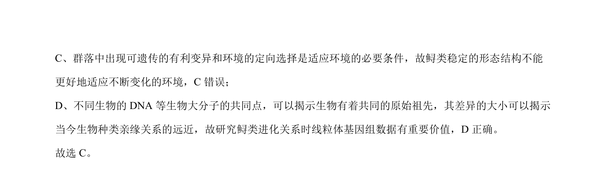

## 题面

## 摘要

该题通过鲟类案例考查生物进化证据、地理隔离作用及适应的条件。

## 关联考点

- [[559-化石证据|化石证据]]
- [[469-共同祖先|共同祖先]]
- [[572-地理隔离|地理隔离]]
- [[184-自然选择|自然选择]]

## 答案与解析

> 📄 原 PDF 第 5 页：`素材/真题/吉林/2008-2024·（吉林）生物高考真题/2024年高考生物试卷（辽宁）（解析卷）.pdf`

<!-- 题干文本-start -->
## 题干文本
8. 鲟类是最古老的鱼类之一，被誉为鱼类的“活化石”。我国学者新测定了中华鲟、长江鲟等的线粒体基因
组，结合已有信息将鲟科分为尖吻鲟类、大西洋鲟类和太平洋鲟类三个类群。下列叙述错误的是（    ）
A. 鲟类的形态结构和化石记录可为生物进化提供证据
B. 地理隔离在不同水域分布的鲟类进化过程中起作用
C. 鲟类稳定的形态结构能更好地适应不断变化的环境
D. 研究鲟类进化关系时线粒体基因组数据有重要价值
<!-- 题干文本-end -->

<!-- 解析文本-start -->
## 解析文本
【答案】C
【解析】
【分析】化石是指通过自然作用保存在地层中的古代生物的遗体、遗物或生活痕迹等。
【详解】A、比较脊椎动物的器官、系统的形态结构，可以为这些生物是否有共同祖先寻找证据，化石是
研究生物进化最直接、最重要的证据，所以鲟类的形态结构和化石记录可为生物进化提供证据，A 正确；
B、地理隔离是指同一种生物由于地理上的障碍而分成不同的种群，使得种群间不能发生基因交流的现
象，不同的地理环境可以对生物的变异进行选择，进而影响生物的进化，故地理隔离在不同水域分布的鲟
类进化过程中起作用，B正确；
<!-- 解析文本-end -->
