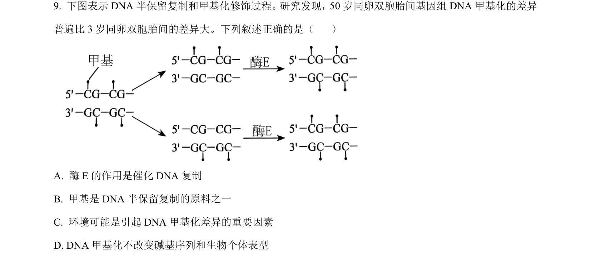
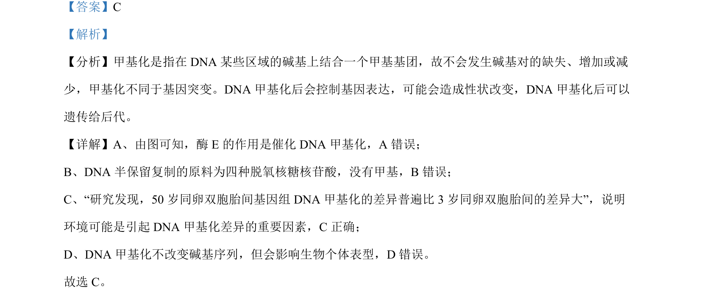

## 题面

## 摘要

考查DNA甲基化对基因表达及性状的影响，结合实例说明环境因素与甲基化差异的关系

## 关联考点

- [[525-DNA甲基化|DNA甲基化]]
- [[706-表观遗传|表观遗传]]
- [[581-基因表达调控|基因表达调控]]
- [[638-环境影响|环境影响]]

## 答案与解析

> 📄 原 PDF 第 6 页：`素材/真题/吉林/2008-2024·（吉林）生物高考真题/2024年高考生物试卷（辽宁）（解析卷）.pdf`
