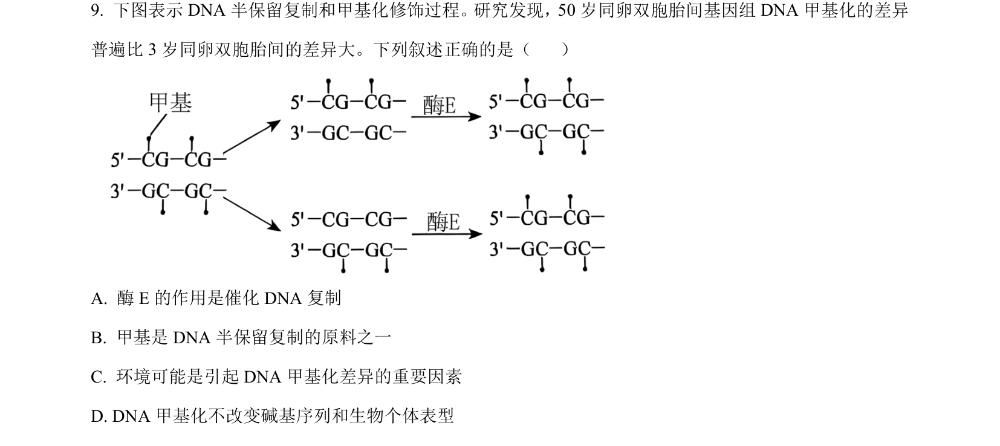
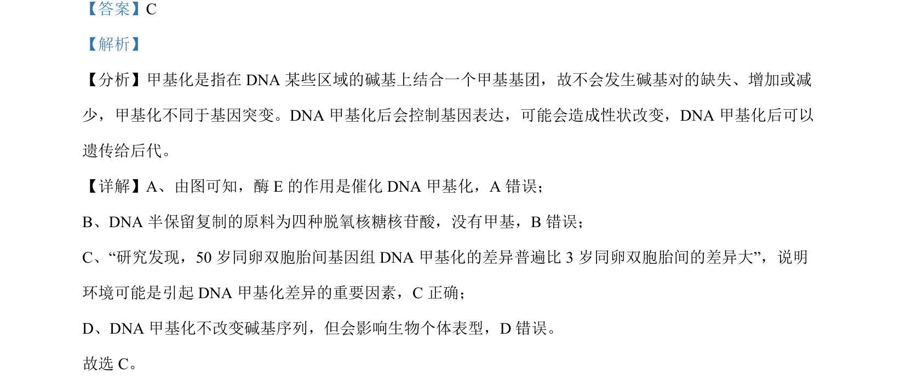

## 题面

## 摘要

考查DNA甲基化对基因表达及性状的影响，结合实例说明环境因素与甲基化差异的关系

## 关联考点

- [[525-DNA甲基化|DNA甲基化]]
- [[706-表观遗传|表观遗传]]
- [[581-基因表达调控|基因表达调控]]
- [[638-环境影响|环境影响]]

## 答案与解析

> 📄 原 PDF 第 6 页：`素材/真题/吉林/2008-2024·（吉林）生物高考真题/2024年高考生物试卷（辽宁）（解析卷）.pdf`

<!-- 题干文本-start -->
## 题干文本
9. 下图表示 DNA 半保留复制和甲基化修饰过程。研究发现，50 岁同卵双胞胎间基因组 DNA 甲基化的差异
普遍比 3 岁同卵双胞胎间的差异大。下列叙述正确的是（    ）
A. 酶 E的作用是催化 DNA 复制
B. 甲基是 DNA 半保留复制的原料之一
C. 环境可能是引起 DNA 甲基化差异的重要因素
D. DNA 甲基化不改变碱基序列和生物个体表型
<!-- 题干文本-end -->

<!-- 解析文本-start -->
## 解析文本
【答案】C
【解析】
【分析】甲基化是指在 DNA 某些区域的碱基上结合一个甲基基团，故不会发生碱基对的缺失、增加或减
少，甲基化不同于基因突变。DNA 甲基化后会控制基因表达，可能会造成性状改变，DNA 甲基化后可以
遗传给后代。
【详解】A、由图可知，酶 E的作用是催化 DNA 甲基化，A 错误；
B、DNA 半保留复制的原料为四种脱氧核糖核苷酸，没有甲基，B错误；
C、“研究发现，50 岁同卵双胞胎间基因组 DNA 甲基化的差异普遍比 3 岁同卵双胞胎间的差异大”，说明
环境可能是引起 DNA 甲基化差异的重要因素，C正确；
D、DNA 甲基化不改变碱基序列，但会影响生物个体表型，D 错误。
故选 C。
<!-- 解析文本-end -->
