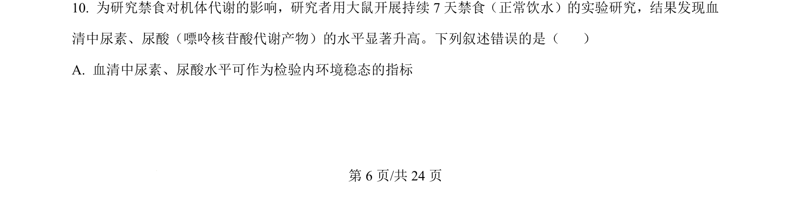
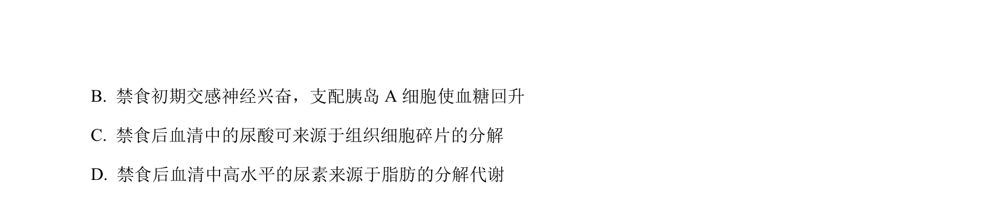
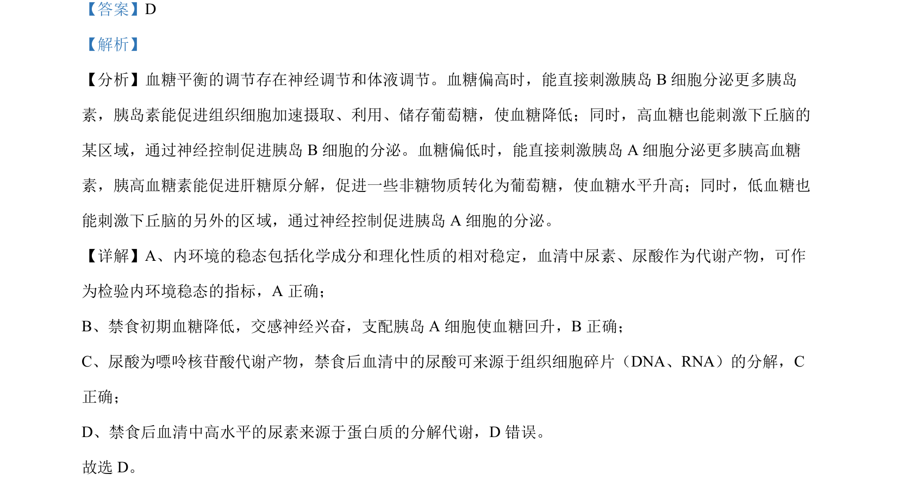

## 题面

## 摘要

该题考查内环境稳态及血糖调节的神经体液机制。

## 关联考点

- [[血糖调节]]
- [[314-内环境稳态|内环境稳态]]
- [[324-神经调节|神经调节]]
- [[331-激素调节|激素调节]]

## 答案与解析

> 📄 原 PDF 第 6 页：`素材/真题/吉林/2008-2024·（吉林）生物高考真题/2024年高考生物试卷（辽宁）（解析卷）.pdf`
