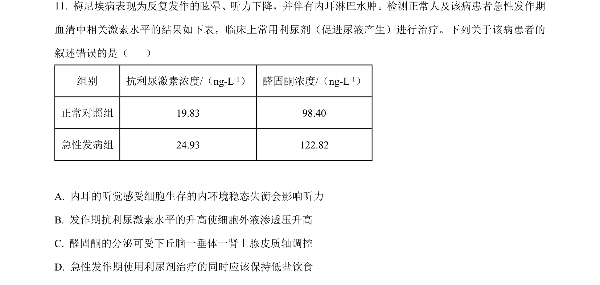
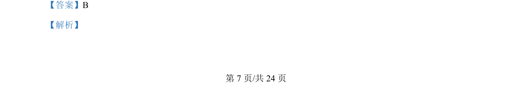
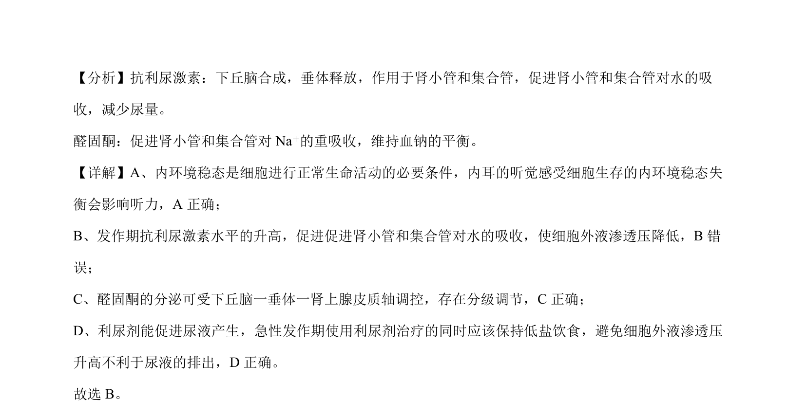

## 题面

## 摘要

该题考查抗利尿激素与醛固酮的生理作用及水盐平衡调节，判断相关叙述正误。

## 关联考点

- [[314-内环境稳态|内环境稳态]]
- [[094-激素|抗利尿激素]]
- [[728-醛固酮|醛固酮]]
- [[624-水盐平衡调节|水盐平衡调节]]

## 答案与解析

> 📄 原 PDF 第 7 页：`素材/真题/吉林/2008-2024·（吉林）生物高考真题/2024年高考生物试卷（辽宁）（解析卷）.pdf`
