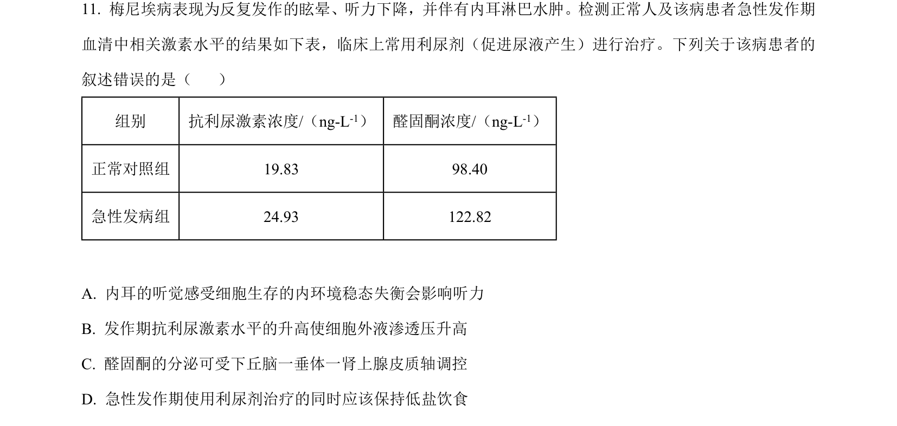
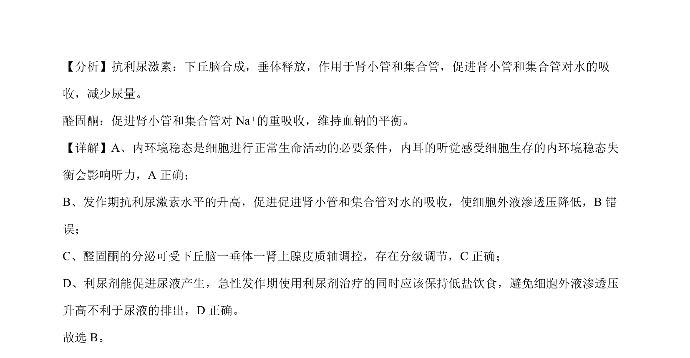

## 题面

## 摘要

该题考查抗利尿激素与醛固酮的生理作用及水盐平衡调节，判断相关叙述正误。

## 关联考点

- [[314-内环境稳态|内环境稳态]]
- [[094-激素|抗利尿激素]]
- [[728-醛固酮|醛固酮]]
- [[624-水盐平衡调节|水盐平衡调节]]

## 答案与解析

> 📄 原 PDF 第 7 页：`素材/真题/吉林/2008-2024·（吉林）生物高考真题/2024年高考生物试卷（辽宁）（解析卷）.pdf`

<!-- 题干文本-start -->
## 题干文本
11. 梅尼埃病表现为反复发作的眩晕、听力下降，并伴有内耳淋巴水肿。检测正常人及该病患者急性发作期
血清中相关激素水平的结果如下表，临床上常用利尿剂（促进尿液产生）进行治疗。下列关于该病患者的
叙述错误的是（    ）
组别 抗利尿激素浓度/（ng-L-1） 醛固酮浓度/（ng-L-1）
正常对照组 19.83 98.40
急性发病组 24.93 122.82
A. 内耳的听觉感受细胞生存的内环境稳态失衡会影响听力
B. 发作期抗利尿激素水平的升高使细胞外液渗透压升高
C. 醛固酮的分泌可受下丘脑一垂体一肾上腺皮质轴调控
D. 急性发作期使用利尿剂治疗的同时应该保持低盐饮食
<!-- 题干文本-end -->

<!-- 解析文本-start -->
## 解析文本
【答案】B
【解析】
<!-- 解析文本-end -->
