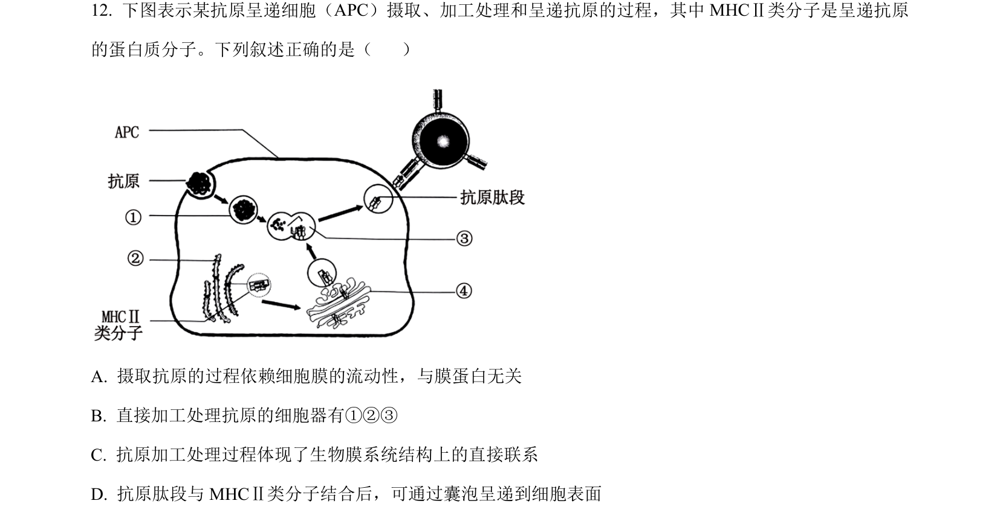
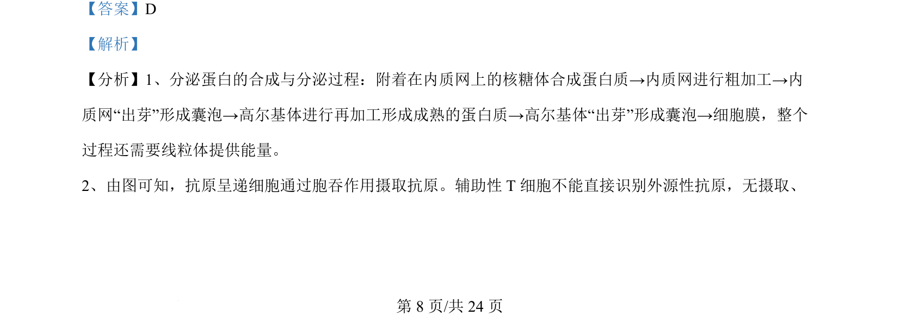
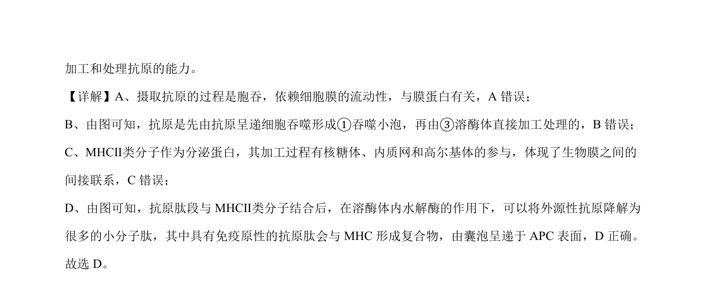

## 题面

## 摘要

考查抗原呈递细胞通过胞吞摄取抗原、溶酶体加工及MHC II类分子经囊泡将抗原肽段呈递至细胞表面的过程。

## 关联考点

- [[156-免疫|免疫]]
- [[489-抗原呈递|抗原呈递]]
- [[227-生物膜系统|生物膜系统]]
- [[229-细胞器|细胞器]]

## 答案与解析

> 📄 原 PDF 第 8 页：`素材/真题/吉林/2008-2024·（吉林）生物高考真题/2024年高考生物试卷（辽宁）（解析卷）.pdf`

<!-- 题干文本-start -->
## 题干文本
12. 下图表示某抗原呈递细胞（APC）摄取、加工处理和呈递抗原的过程，其中 MHCⅡ类分子是呈递抗原
的蛋白质分子。下列叙述正确的是（    ）
A. 摄取抗原的过程依赖细胞膜的流动性，与膜蛋白无关
B. 直接加工处理抗原的细胞器有①②③
C. 抗原加工处理过程体现了生物膜系统结构上的直接联系
D. 抗原肽段与 MHCⅡ类分子结合后，可通过囊泡呈递到细胞表面
<!-- 题干文本-end -->

<!-- 解析文本-start -->
## 解析文本
【答案】D
【解析】
【分析】1、分泌蛋白的合成与分泌过程：附着在内质网上的核糖体合成蛋白质→内质网进行粗加工→内
质网“出芽”形成囊泡→高尔基体进行再加工形成成熟的蛋白质→高尔基体“出芽”形成囊泡→细胞膜，整个
过程还需要线粒体提供能量。
2、由图可知，抗原呈递细胞通过胞吞作用摄取抗原。辅助性 T细胞不能直接识别外源性抗原，无摄取、
<!-- 解析文本-end -->
