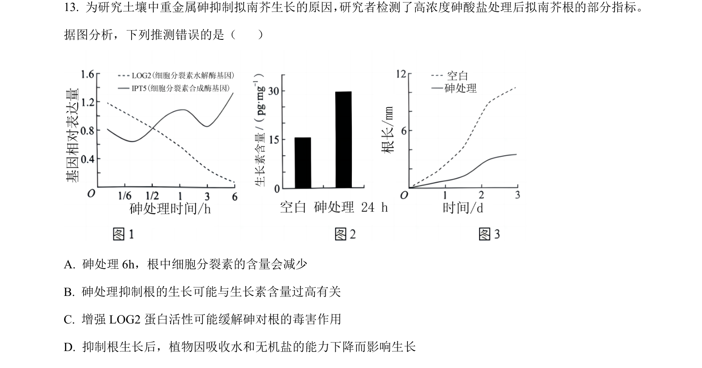
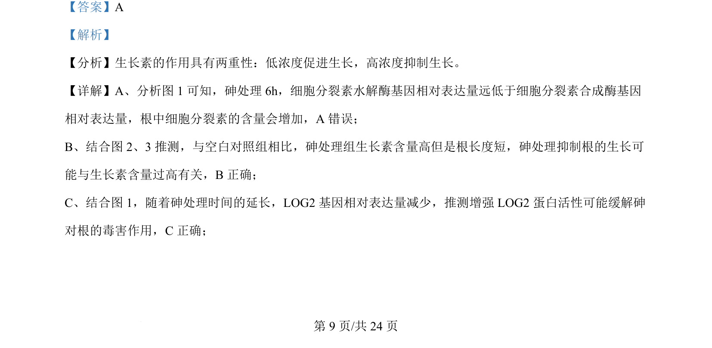
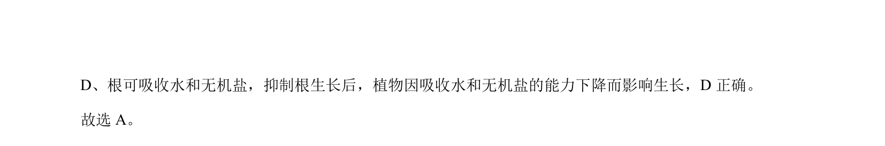

## 题面

## 摘要

该题通过实验数据考查砷处理对拟南芥根中激素含量及相关基因表达的影响。

## 关联考点

- [[347-生长素|生长素]]
- [[349-细胞分裂素|细胞分裂素]]
- [[843-基因的表达|基因表达]]

## 答案与解析

> 📄 原 PDF 第 9 页：`素材/真题/吉林/2008-2024·（吉林）生物高考真题/2024年高考生物试卷（辽宁）（解析卷）.pdf`

<!-- 题干文本-start -->
## 题干文本
13. 为研究土壤中重金属砷抑制拟南芥生长的原因， 研究者检测了高浓度砷酸盐处理后拟南芥根的部分指标。
据图分析，下列推测错误的是（    ）
A. 砷处理 6h，根中细胞分裂素的含量会减少
B. 砷处理抑制根的生长可能与生长素含量过高有关
C. 增强 LOG2 蛋白活性可能缓解砷对根的毒害作用
D. 抑制根生长后，植物因吸收水和无机盐的能力下降而影响生长
<!-- 题干文本-end -->

<!-- 解析文本-start -->
## 解析文本
【答案】A
【解析】
【分析】生长素的作用具有两重性：低浓度促进生长，高浓度抑制生长。
【详解】A、分析图 1 可知，砷处理 6h，细胞分裂素水解酶基因相对表达量远低于细胞分裂素合成酶基因
相对表达量，根中细胞分裂素的含量会增加，A 错误；
B、结合图 2、3推测，与空白对照组相比，砷处理组生长素含量高但是根长度短，砷处理抑制根的生长可
能与生长素含量过高有关，B正确；
C、结合图 1，随着砷处理时间的延长，LOG2 基因相对表达量减少，推测增强 LOG2 蛋白活性可能缓解砷
对根的毒害作用，C正确；
<!-- 解析文本-end -->
