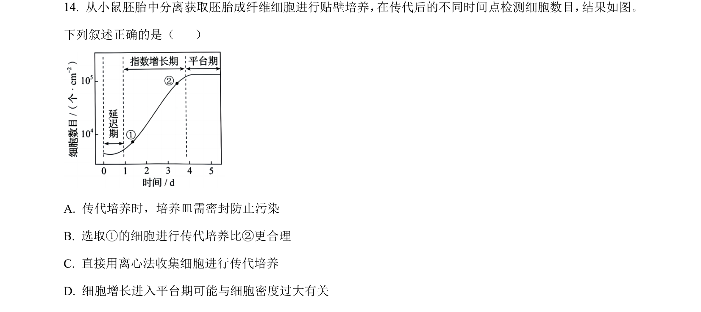
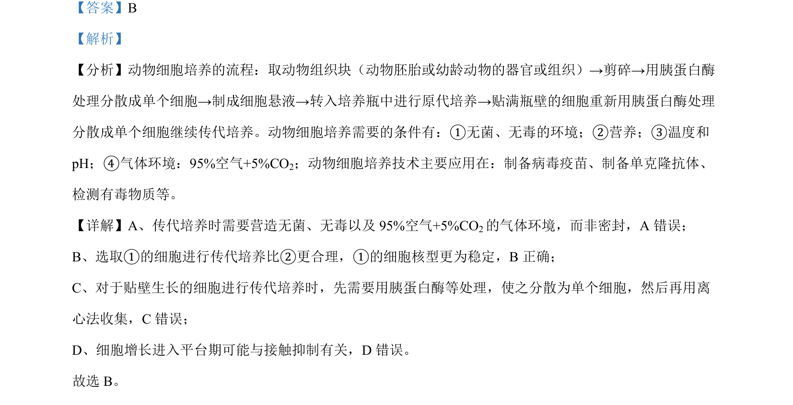

## 题面

## 摘要

该题考查动物细胞传代培养的条件和细胞增长特点。

## 关联考点

- [[449-动物细胞培养|动物细胞培养]]
- [[541-传代培养|传代培养]]
- [[604-接触抑制|接触抑制]]

## 答案与解析

> 📄 原 PDF 第 10 页：`素材/真题/吉林/2008-2024·（吉林）生物高考真题/2024年高考生物试卷（辽宁）（解析卷）.pdf`
