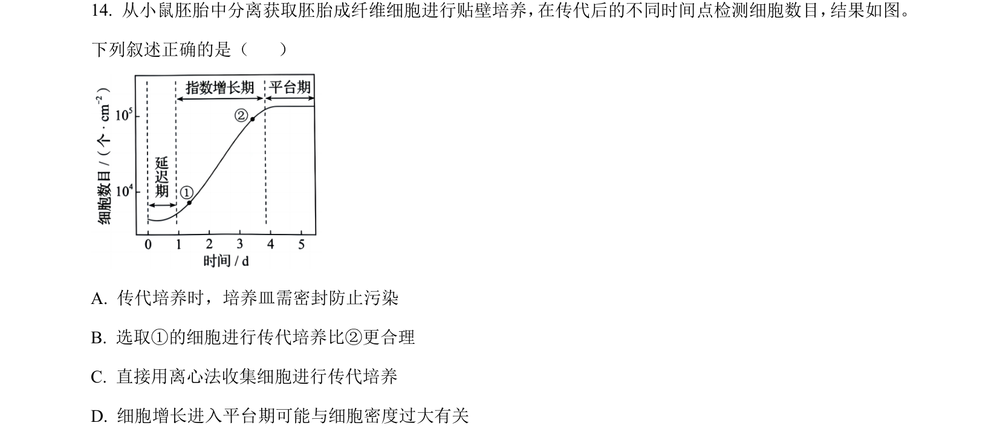
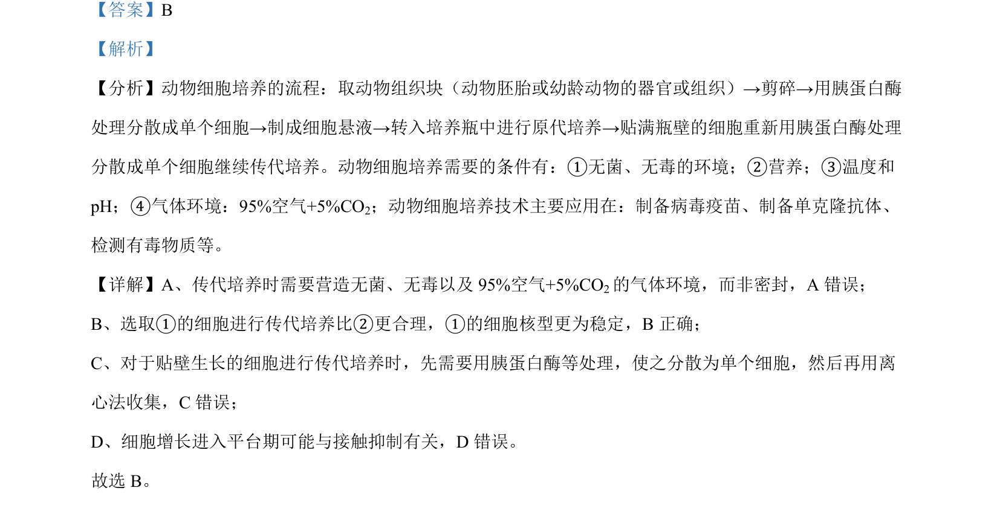

## 题面

## 摘要

该题考查动物细胞传代培养的条件和细胞增长特点。

## 关联考点

- [[449-动物细胞培养|动物细胞培养]]
- [[541-传代培养|传代培养]]
- [[604-接触抑制|接触抑制]]

## 答案与解析

> 📄 原 PDF 第 10 页：`素材/真题/吉林/2008-2024·（吉林）生物高考真题/2024年高考生物试卷（辽宁）（解析卷）.pdf`

<!-- 题干文本-start -->
## 题干文本
14. 从小鼠胚胎中分离获取胚胎成纤维细胞进行贴壁培养， 在传代后的不同时间点检测细胞数目， 结果如图。
下列叙述正确的是（    ）
A. 传代培养时，培养皿需密封防止污染
B. 选取①的细胞进行传代培养比②更合理
C. 直接用离心法收集细胞进行传代培养
D. 细胞增长进入平台期可能与细胞密度过大有关
<!-- 题干文本-end -->

<!-- 解析文本-start -->
## 解析文本
【答案】B
【解析】
【分析】动物细胞培养的流程：取动物组织块（动物胚胎或幼龄动物的器官或组织）→剪碎→用胰蛋白酶
处理分散成单个细胞→制成细胞悬液→转入培养瓶中进行原代培养→贴满瓶壁的细胞重新用胰蛋白酶处理
分散成单个细胞继续传代培养。动物细胞培养需要的条件有：①无菌、无毒的环境；②营养；③温度和
pH；④气体环境：95%空气+5%CO2；动物细胞培养技术主要应用在：制备病毒疫苗、制备单克隆抗体、
检测有毒物质等。
【详解】A、传代培养时需要营造无菌、无毒以及 95%空气+5%CO2的气体环境，而非密封，A 错误；
B、选取①的细胞进行传代培养比②更合理，①的细胞核型更为稳定，B正确；
C、对于贴壁生长的细胞进行传代培养时，先需要用胰蛋白酶等处理，使之分散为单个细胞，然后再用离
心法收集，C错误；
D、细胞增长进入平台期可能与接触抑制有关，D 错误。
故选 B。
<!-- 解析文本-end -->
