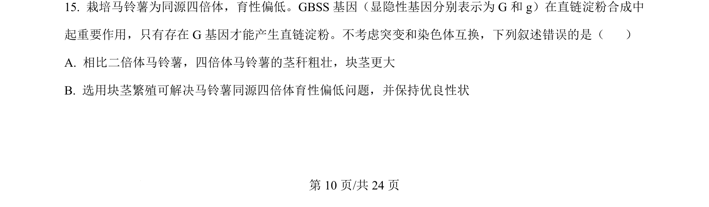
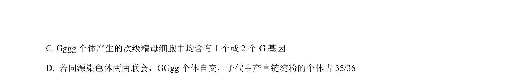
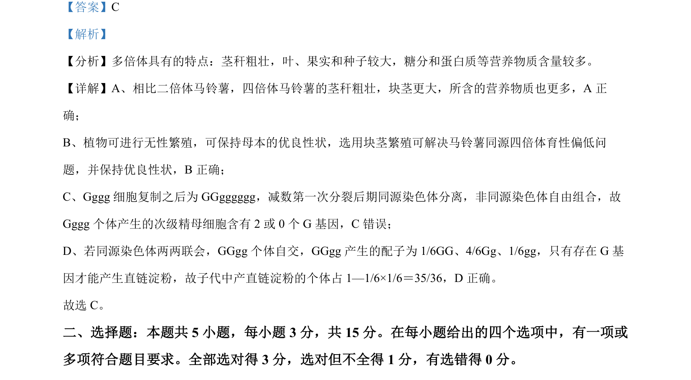

## 题面

## 摘要

本题以马铃薯育种为情境，考查同源四倍体的特点及无性繁殖的应用。

## 关联考点

- [[807-染色体组|染色体组]]
- [[175-无性生殖|无性生殖]]
- [[722-遗传育种|遗传育种]]

## 答案与解析

> 📄 原 PDF 第 10 页：`素材/真题/吉林/2008-2024·（吉林）生物高考真题/2024年高考生物试卷（辽宁）（解析卷）.pdf`
