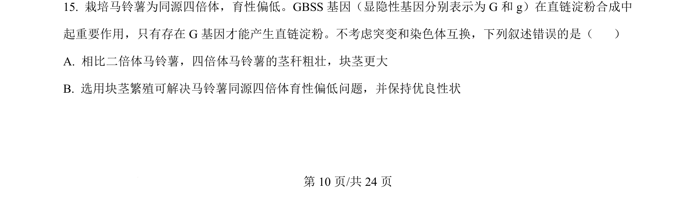
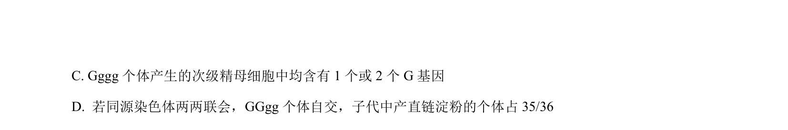
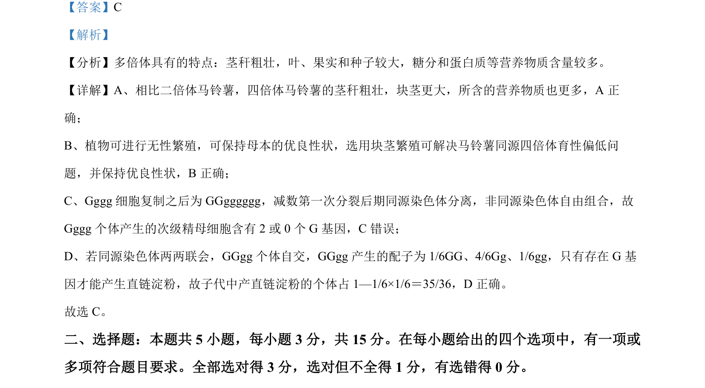

## 题面

## 摘要

本题以马铃薯育种为情境，考查同源四倍体的特点及无性繁殖的应用。

## 关联考点

- [[807-染色体组|染色体组]]
- [[175-无性生殖|无性生殖]]
- [[722-遗传育种|遗传育种]]

## 答案与解析

> 📄 原 PDF 第 10 页：`素材/真题/吉林/2008-2024·（吉林）生物高考真题/2024年高考生物试卷（辽宁）（解析卷）.pdf`

<!-- 题干文本-start -->
## 题干文本
15. 栽培马铃薯为同源四倍体，育性偏低。GBSS 基因（显隐性基因分别表示为 G 和 g）在直链淀粉合成中
起重要作用，只有存在 G 基因才能产生直链淀粉。不考虑突变和染色体互换，下列叙述错误的是（    ）
A. 相比二倍体马铃薯，四倍体马铃薯的茎秆粗壮，块茎更大
B. 选用块茎繁殖可解决马铃薯同源四倍体育性偏低问题，并保持优良性状
<!-- 题干文本-end -->

<!-- 解析文本-start -->
## 解析文本

<!-- 解析文本-end -->
