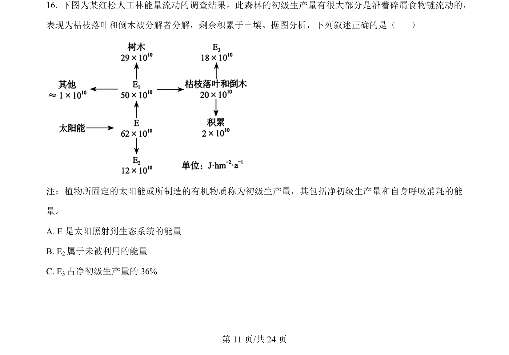
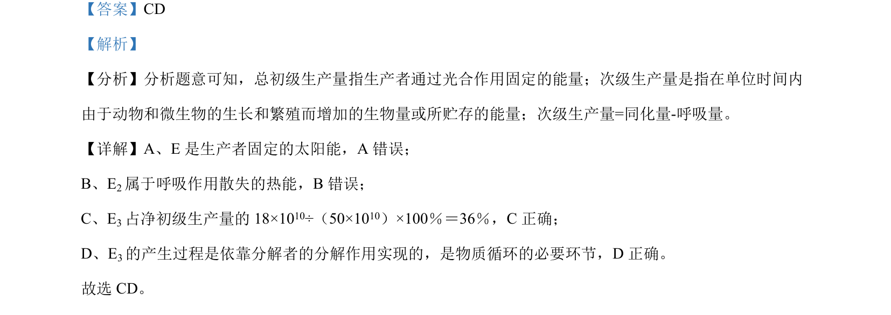

## 题面

## 摘要

红松人工林能量流动调查，分析初级生产量、净初级生产量和能量去向。

## 关联考点

- [[385-生态系统能量流动|能量流动]]
- [[555-初级生产量|初级生产量]]
- [[553-净初级生产量|净初级生产量]]
- [[569-呼吸消耗|呼吸消耗]]

## 答案与解析

> 📄 原 PDF 第 11 页：`素材/真题/吉林/2008-2024·（吉林）生物高考真题/2024年高考生物试卷（辽宁）（解析卷）.pdf`
