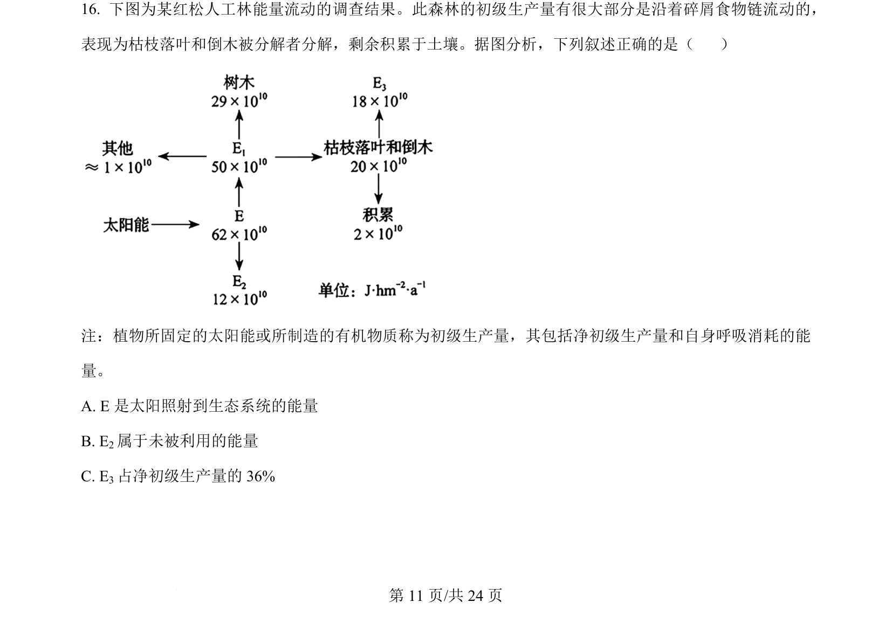
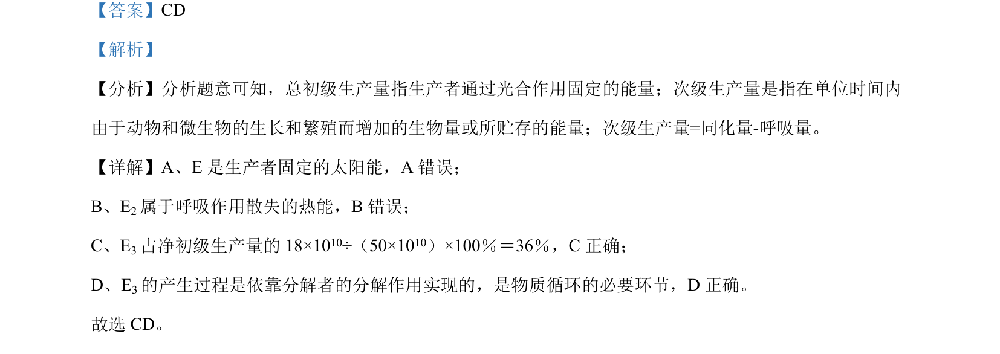

## 题面

## 摘要

红松人工林能量流动调查，分析初级生产量、净初级生产量和能量去向。

## 关联考点

- [[385-生态系统能量流动|能量流动]]
- [[555-初级生产量|初级生产量]]
- [[553-净初级生产量|净初级生产量]]
- [[569-呼吸消耗|呼吸消耗]]

## 答案与解析

> 📄 原 PDF 第 11 页：`素材/真题/吉林/2008-2024·（吉林）生物高考真题/2024年高考生物试卷（辽宁）（解析卷）.pdf`

<!-- 题干文本-start -->
## 题干文本
16. 下图为某红松人工林能量流动的调查结果。此森林的初级生产量有很大部分是沿着碎屑食物链流动的，
表现为枯枝落叶和倒木被分解者分解，剩余积累于土壤。据图分析，下列叙述正确的是（    ）
  
注：植物所固定的太阳能或所制造的有机物质称为初级生产量，其包括净初级生产量和自身呼吸消耗的能
量。
A. E 是太阳照射到生态系统的能量
B. E2属于未被利用的能量
C. E3占净初级生产量的 36%
<!-- 题干文本-end -->

<!-- 解析文本-start -->
## 解析文本

<!-- 解析文本-end -->
