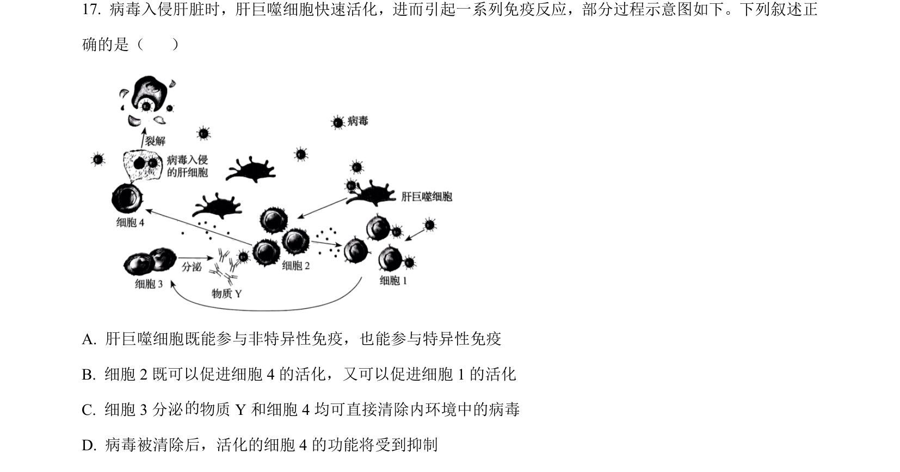
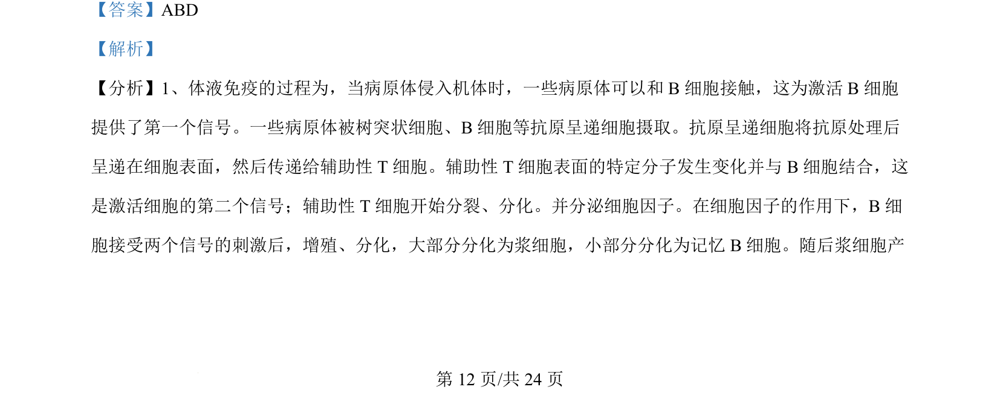
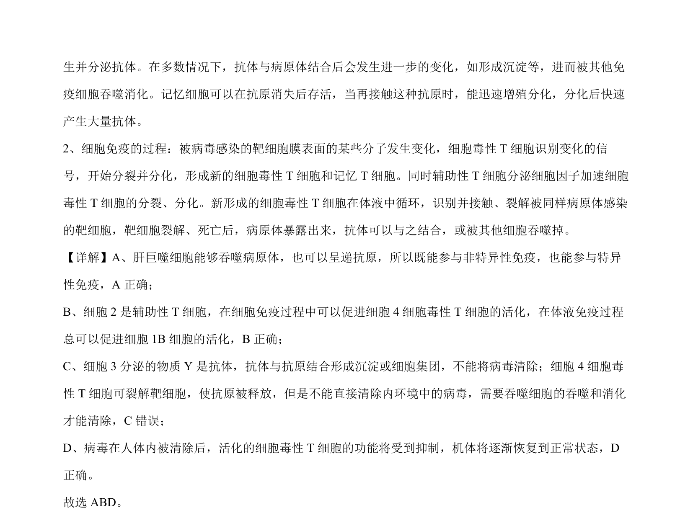

## 题面

## 摘要

本题结合病毒入侵肝脏的免疫反应示意图，考查肝巨噬细胞在非特异性与特异性免疫中的作用及免疫细胞间的相互作用。

## 关联考点

- [[156-免疫|免疫调节]]
- [[739-非特异性免疫|非特异性免疫]]
- [[637-特异性免疫|特异性免疫]]
- [[353-体液免疫|体液免疫]]

## 答案与解析

> 📄 原 PDF 第 12 页：`素材/真题/吉林/2008-2024·（吉林）生物高考真题/2024年高考生物试卷（辽宁）（解析卷）.pdf`
