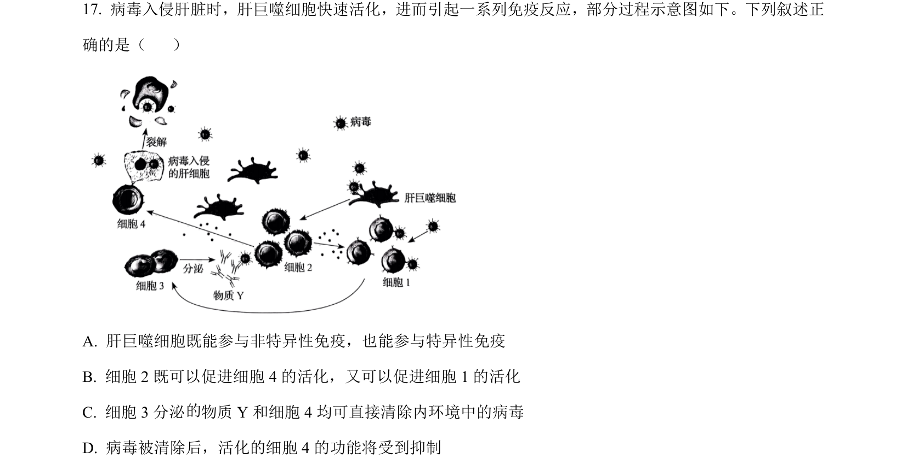
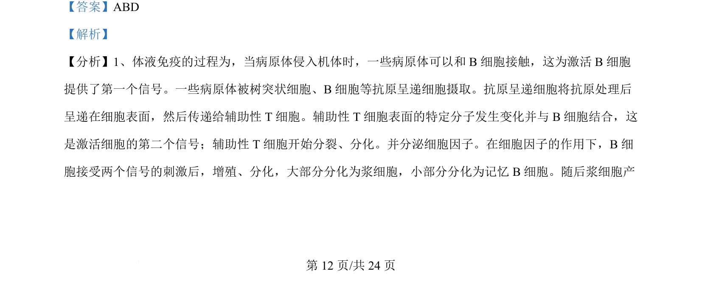
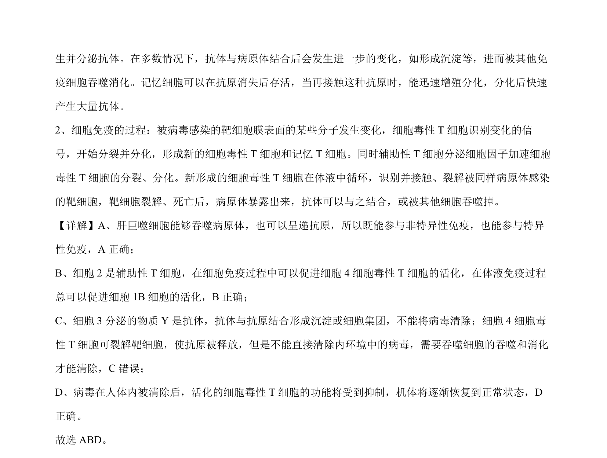

## 题面

## 摘要

本题结合病毒入侵肝脏的免疫反应示意图，考查肝巨噬细胞在非特异性与特异性免疫中的作用及免疫细胞间的相互作用。

## 关联考点

- [[156-免疫|免疫调节]]
- [[739-非特异性免疫|非特异性免疫]]
- [[637-特异性免疫|特异性免疫]]
- [[353-体液免疫|体液免疫]]

## 答案与解析

> 📄 原 PDF 第 12 页：`素材/真题/吉林/2008-2024·（吉林）生物高考真题/2024年高考生物试卷（辽宁）（解析卷）.pdf`

<!-- 题干文本-start -->
## 题干文本
17. 病毒入侵肝脏时，肝巨噬细胞快速活化，进而引起一系列免疫反应，部分过程示意图如下。下列叙述正
确的是（    ）
A. 肝巨噬细胞既能参与非特异性免疫，也能参与特异性免疫
B. 细胞 2 既可以促进细胞 4 的活化，又可以促进细胞 1的活化
C. 细胞 3 分泌 物质 Y 和细胞 4 均可直接清除内环境中的病毒
D. 病毒被清除后，活化的细胞 4 的功能将受到抑制
<!-- 题干文本-end -->

<!-- 解析文本-start -->
## 解析文本
【答案】ABD
【解析】
【分析】1、体液免疫的过程为，当病原体侵入机体时，一些病原体可以和 B细胞接触，这为激活 B细胞
提供了第一个信号。一些病原体被树突状细胞、B细胞等抗原呈递细胞摄取。抗原呈递细胞将抗原处理后
呈递在细胞表面，然后传递给辅助性 T细胞。辅助性 T细胞表面的特定分子发生变化并与 B细胞结合，这
是激活细胞的第二个信号；辅助性 T细胞开始分裂、分化。并分泌细胞因子。在细胞因子的作用下，B细
胞接受两个信号的刺激后，增殖、分化，大部分分化为浆细胞，小部分分化为记忆 B细胞。随后浆细胞产
的
<!-- 解析文本-end -->
