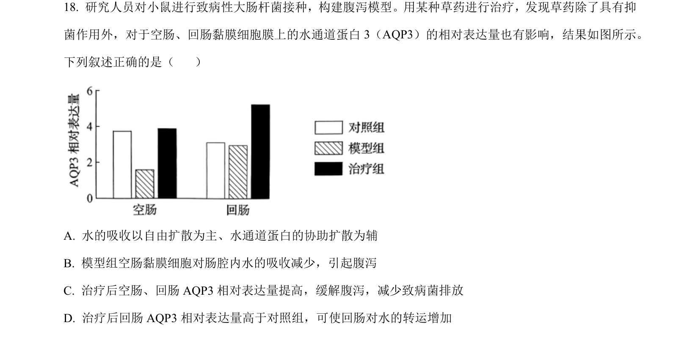
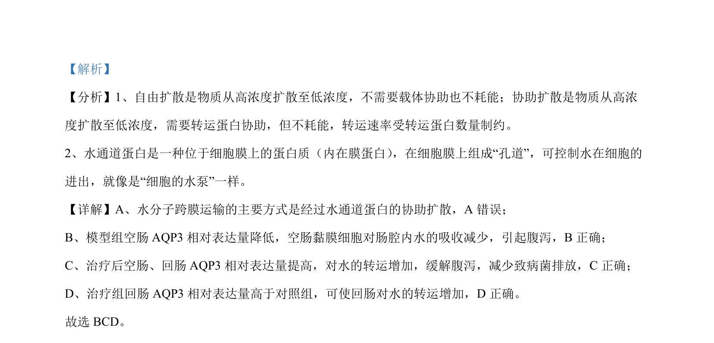

## 题面

## 摘要

该题考查水通道蛋白在腹泻模型中的作用及水的跨膜转运方式。

## 关联考点

- [[635-物质跨膜运输|物质跨膜运输]]
- [[625-水通道蛋白|水通道蛋白]]
- [[666-实验分析|实验分析]]

## 答案与解析

> 📄 原 PDF 第 13 页：`素材/真题/吉林/2008-2024·（吉林）生物高考真题/2024年高考生物试卷（辽宁）（解析卷）.pdf`

<!-- 题干文本-start -->
## 题干文本
18. 研究人员对小鼠进行致病性大肠杆菌接种，构建腹泻模型。用某种草药进行治疗，发现草药除了具有抑
菌作用外，对于空肠、回肠黏膜细胞膜上的水通道蛋白 3（AQP3）的相对表达量也有影响，结果如图所示。
下列叙述正确的是（    ）
A. 水的吸收以自由扩散为主、水通道蛋白的协助扩散为辅
B. 模型组空肠黏膜细胞对肠腔内水的吸收减少，引起腹泻
C. 治疗后空肠、回肠 AQP3 相对表达量提高，缓解腹泻，减少致病菌排放
D. 治疗后回肠 AQP3 相对表达量高于对照组，可使回肠对水的转运增加
<!-- 题干文本-end -->

<!-- 解析文本-start -->
## 解析文本
【答案】BCD
<!-- 解析文本-end -->
