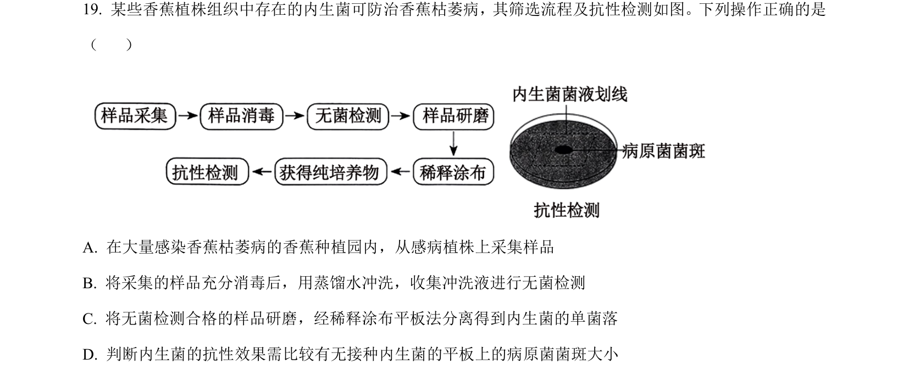
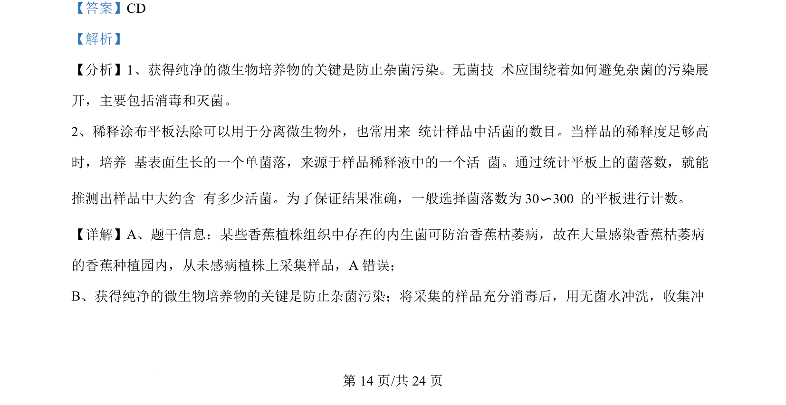
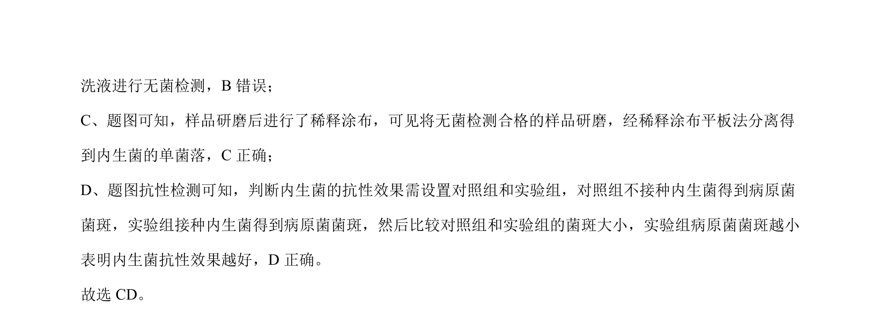

## 题面

## 摘要

内生菌分离筛选流程及抗性检测的操作判断

## 关联考点

- [[487-微生物分离|微生物分离]]
- [[608-无菌技术|无菌技术]]
- [[755-稀释涂布平板法|稀释涂布平板法]]

## 答案与解析

> 📄 原 PDF 第 14 页：`素材/真题/吉林/2008-2024·（吉林）生物高考真题/2024年高考生物试卷（辽宁）（解析卷）.pdf`

<!-- 题干文本-start -->
## 题干文本
19. 某些香蕉植株组织中存在的内生菌可防治香蕉枯萎病，其筛选流程及抗性检测如图。下列操作正确的是
（    ）
A. 在大量感染香蕉枯萎病的香蕉种植园内，从感病植株上采集样品
B. 将采集的样品充分消毒后，用蒸馏水冲洗，收集冲洗液进行无菌检测
C. 将无菌检测合格的样品研磨，经稀释涂布平板法分离得到内生菌的单菌落
D. 判断内生菌的抗性效果需比较有无接种内生菌的平板上的病原菌菌斑大小
<!-- 题干文本-end -->

<!-- 解析文本-start -->
## 解析文本
【答案】CD
【解析】
【分析】1、获得纯净的微生物培养物的关键是防止杂菌污染。无菌技 术应围绕着如何避免杂菌的污染展
开，主要包括消毒和灭菌。
2、稀释涂布平板法除可以用于分离微生物外，也常用来 统计样品中活菌的数目。当样品的稀释度足够高
时，培养 基表面生长的一个单菌落，来源于样品稀释液中的一个活 菌。通过统计平板上的菌落数，就能
推测出样品中大约含 有多少活菌。为了保证结果准确，一般选择菌落数为 30〜300 的平板进行计数。
【详解】A、题干信息：某些香蕉植株组织中存在的内生菌可防治香蕉枯萎病，故在大量感染香蕉枯萎病
的香蕉种植园内，从未感病植株上采集样品，A 错误；
B、获得纯净的微生物培养物的关键是防止杂菌污染；将采集的样品充分消毒后，用无菌水冲洗，收集冲
<!-- 解析文本-end -->
