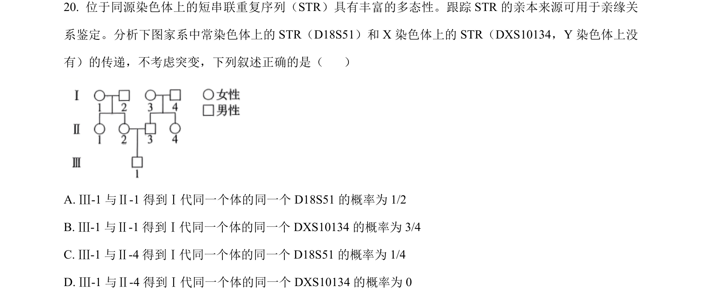
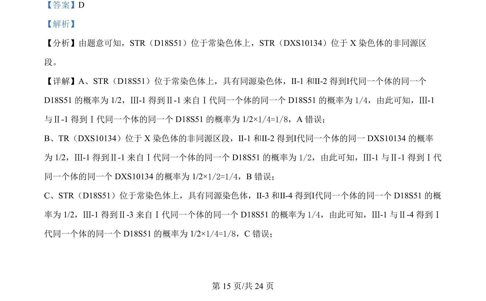
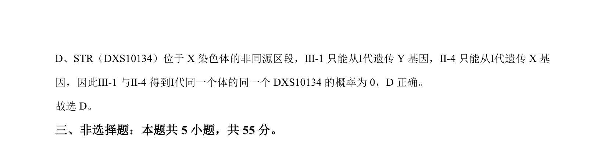

## 题面

## 摘要

用STR标记分析家系中常染色体和X染色体遗传概率。

## 关联考点

- [[505-短串联重复序列（STR）|短串联重复序列（STR）]]
- [[804-常染色体遗传|常染色体遗传]]
- [[533-X染色体连锁遗传|X染色体连锁遗传]]
- [[949-概率计算|概率计算]]

## 答案与解析

> 📄 原 PDF 第 15 页：`素材/真题/吉林/2008-2024·（吉林）生物高考真题/2024年高考生物试卷（辽宁）（解析卷）.pdf`
