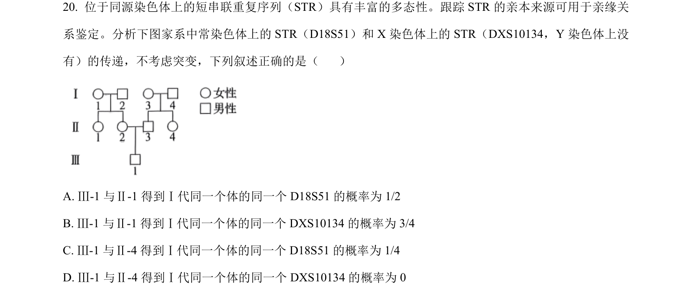
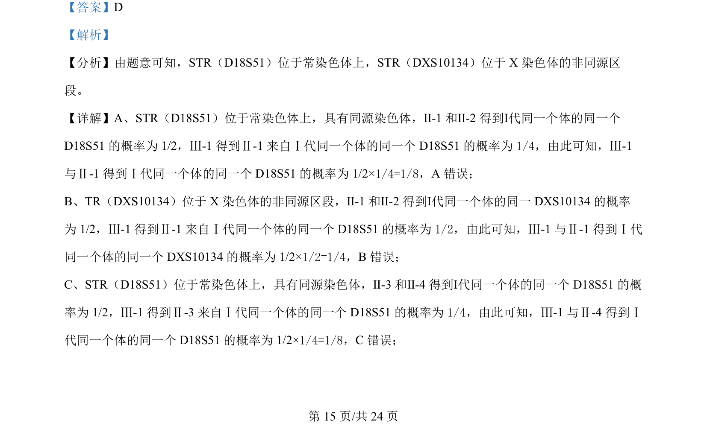
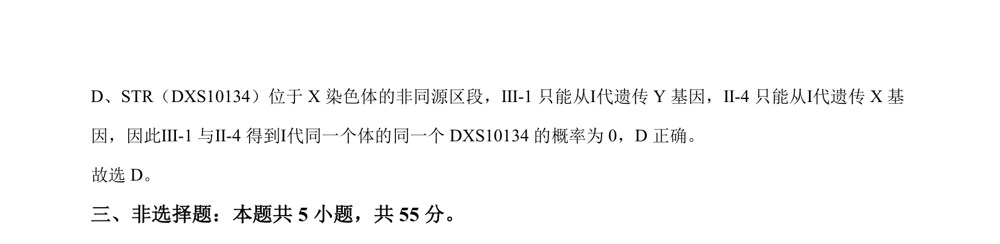

## 题面

## 摘要

用STR标记分析家系中常染色体和X染色体遗传概率。

## 关联考点

- [[505-短串联重复序列（STR）|短串联重复序列（STR）]]
- [[804-常染色体遗传|常染色体遗传]]
- [[533-X染色体连锁遗传|X染色体连锁遗传]]
- [[948-概率计算|概率计算]]

## 答案与解析

> 📄 原 PDF 第 15 页：`素材/真题/吉林/2008-2024·（吉林）生物高考真题/2024年高考生物试卷（辽宁）（解析卷）.pdf`

<!-- 题干文本-start -->
## 题干文本
20. 位于同源染色体上的短串联重复序列（ STR）具有丰富的多态性。跟踪 STR 的亲本来源可用于亲缘关
系鉴定。分析下图家系中常染色体上的 STR（D18S51）和 X 染色体上的 STR（DXS10134，Y 染色体上没
有）的传递，不考虑突变，下列叙述正确的是（    ）
A. Ⅲ-1 与Ⅱ-1 得到Ⅰ代同一个体的同一个 D18S51 的概率为 1/2
B. Ⅲ-1 与Ⅱ-1 得到Ⅰ代同一个体的同一个 DXS10134 的概率为 3/4
C. Ⅲ-1 与Ⅱ-4 得到Ⅰ代同一个体的同一个 D18S51 的概率为 1/4
D. Ⅲ-1 与Ⅱ-4 得到Ⅰ代同一个体的同一个 DXS10134 的概率为 0
<!-- 题干文本-end -->

<!-- 解析文本-start -->
## 解析文本
【答案】D
【解析】
【分析】由题意可知，STR（D18S51）位于常染色体上，STR（DXS10134）位于 X 染色体的非同源区
段。
【详解】A、STR（D18S51）位于常染色体上，具有同源染色体，Ⅱ-1 和Ⅱ-2 得到Ⅰ代同一个体的同一个
D18S51 的概率为 1/2，Ⅲ-1 得到Ⅱ-1 来自Ⅰ代同一个体的同一个 D18S51 的概率为1/4，由此可知，Ⅲ -1
与Ⅱ-1 得到Ⅰ代同一个体的同一个 D18S51 的概率为 1/2×1/4=1/8，A 错误；
B、TR（DXS10134）位于 X 染色体的非同源区段，Ⅱ-1 和Ⅱ-2 得到Ⅰ代同一个体的同一 DXS10134 的概率
为 1/2，Ⅲ-1 得到Ⅱ-1 来自Ⅰ代同一个体的同一个 D18S51 的概率为1/2，由此可知，Ⅲ -1 与Ⅱ-1 得到Ⅰ代
同一个体的同一个 DXS10134 的概率为 1/2×1/2=1/4，B错误；
C、STR（D18S51）位于常染色体上，具有同源染色体，Ⅱ-3 和Ⅱ-4 得到Ⅰ代同一个体的同一个 D18S51 的概
率为 1/2，Ⅲ-1 得到Ⅱ-3 来自Ⅰ代同一个体的同一个 D18S51 的概率为1/4，由此可知，Ⅲ -1 与Ⅱ-4 得到Ⅰ
代同一个体的同一个 D18S51 的概率为 1/2×1/4=1/8，C错误；
<!-- 解析文本-end -->
