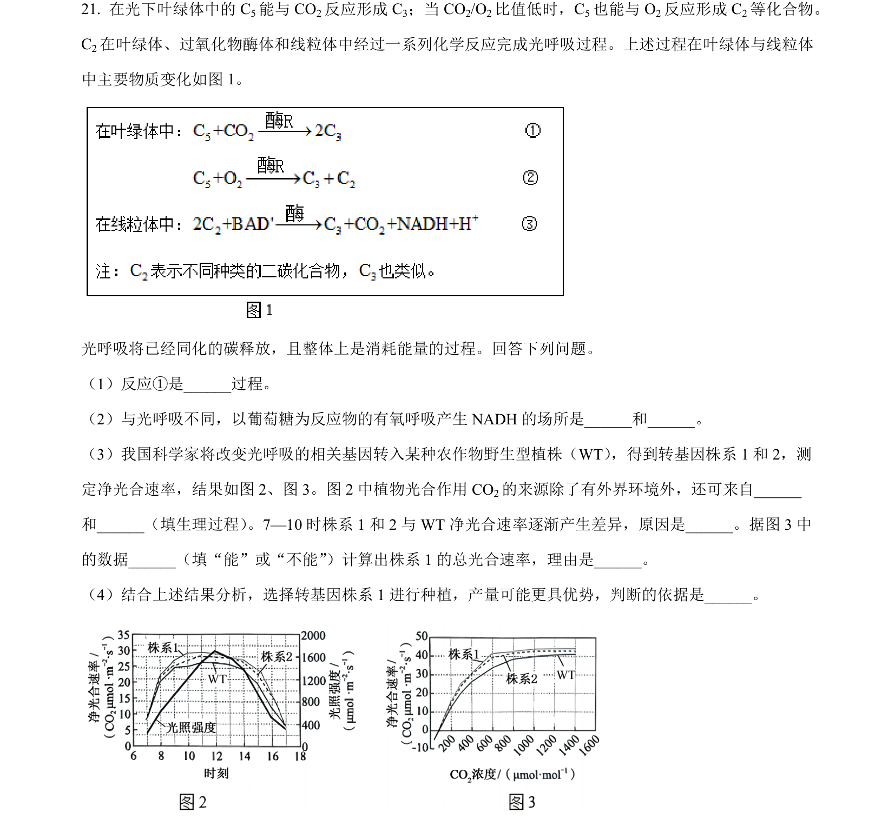
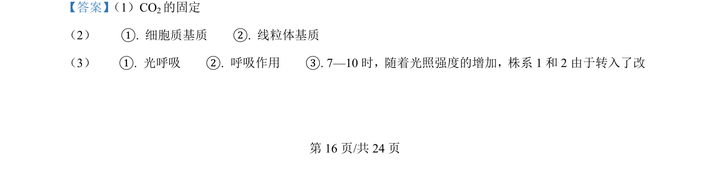
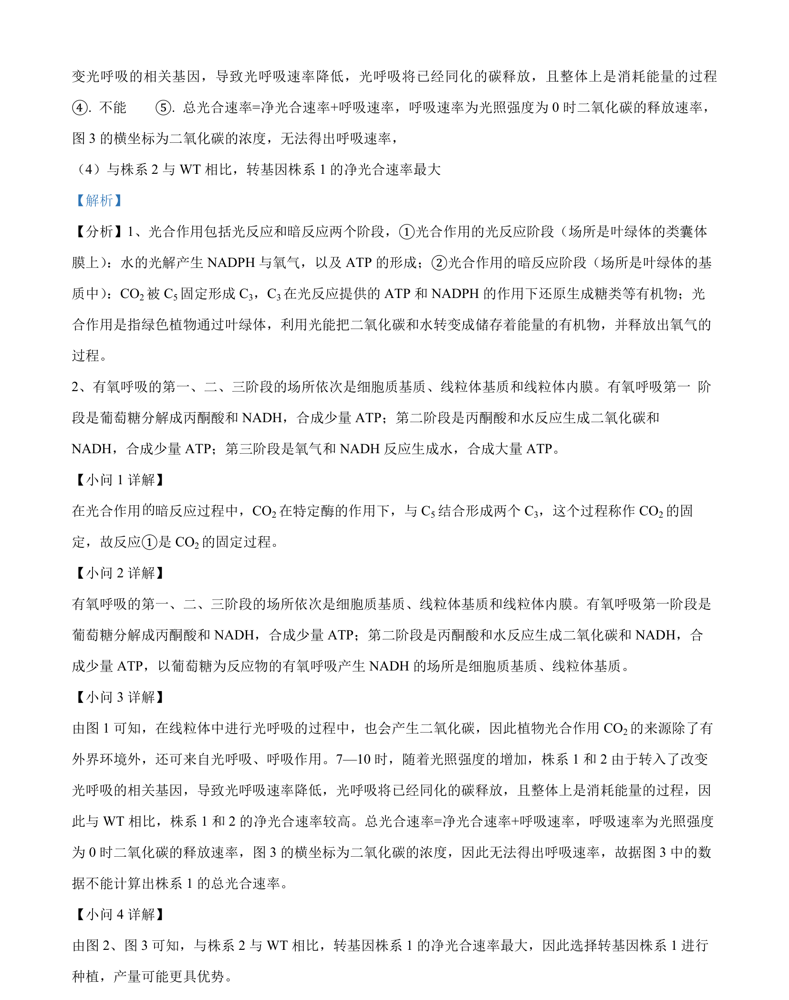

## 题面

## 摘要

本题以光呼吸为背景，结合转基因实验考查光合作用、呼吸作用与净光合速率分析。

## 关联考点

- [[光呼吸]]
- [[033-光合作用|光合作用]]
- [[240-有氧呼吸|有氧呼吸]]
- [[净光合速率]]

## 答案与解析

> 📄 原 PDF 第 16 页：`素材/真题/吉林/2008-2024·（吉林）生物高考真题/2024年高考生物试卷（辽宁）（解析卷）.pdf`
