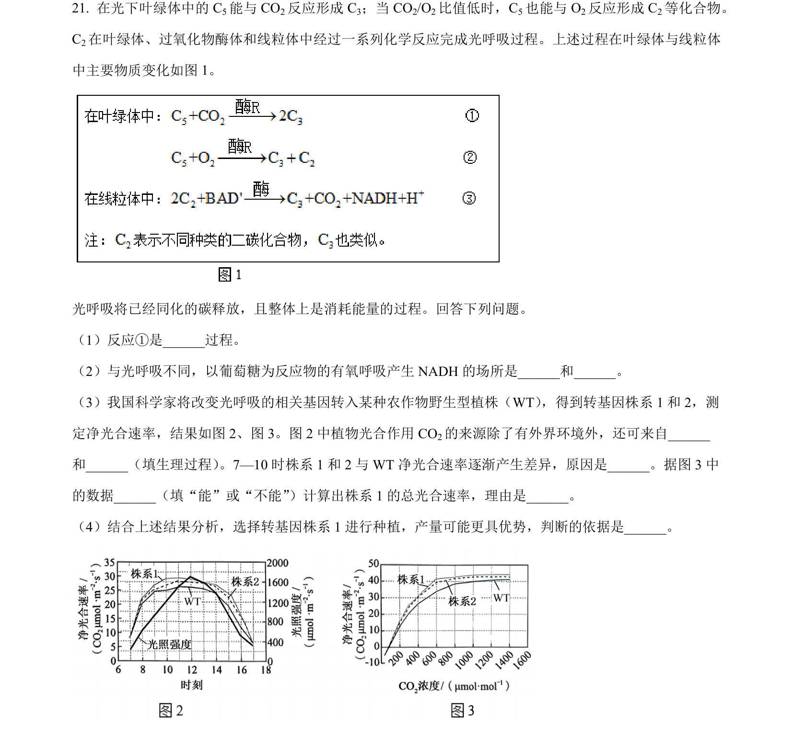
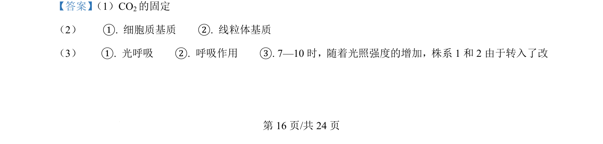
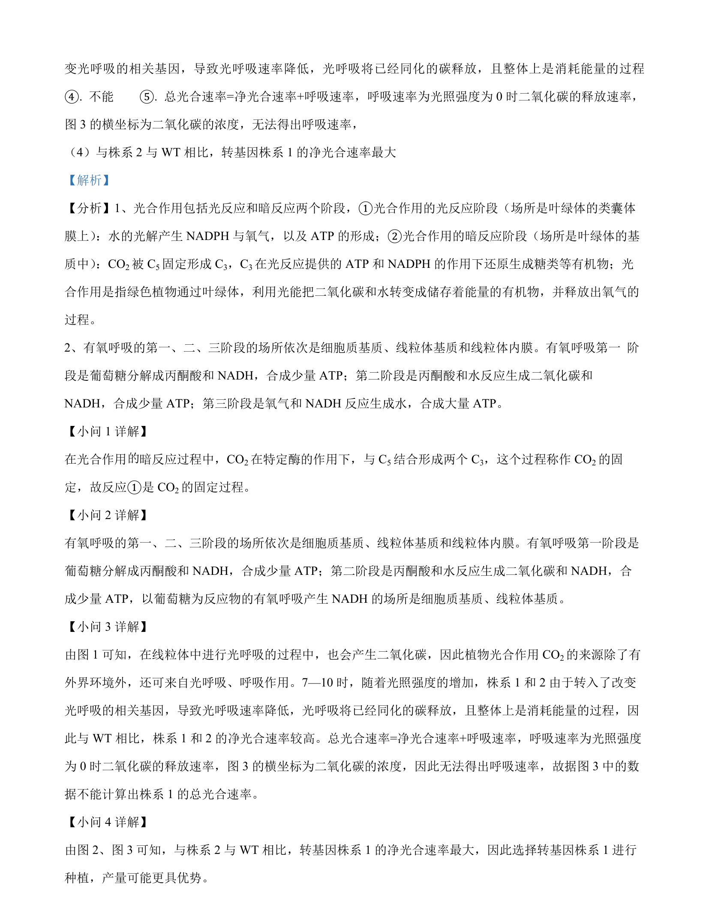

## 题面

## 摘要

本题以光呼吸为背景，结合转基因实验考查光合作用、呼吸作用与净光合速率分析。

## 关联考点

- [[544-光呼吸|光呼吸]]
- [[033-光合作用|光合作用]]
- [[240-有氧呼吸|有氧呼吸]]
- [[552-净光合速率|净光合速率]]

## 答案与解析

> 📄 原 PDF 第 16 页：`素材/真题/吉林/2008-2024·（吉林）生物高考真题/2024年高考生物试卷（辽宁）（解析卷）.pdf`

<!-- 题干文本-start -->
## 题干文本
21. 在光下叶绿体中的 C5能与 CO2反应形成 C3；当 CO2/O2比值低时，C5也能与 O2反应形成 C2等化合物。
C2在叶绿体、过氧化物酶体和线粒体中经过一系列化学反应完成光呼吸过程。上述过程在叶绿体与线粒体
中主要物质变化如图 1。
光呼吸将已经同化的碳释放，且整体上是消耗能量的过程。回答下列问题。
（1）反应①是______过程。
（2）与光呼吸不同，以葡萄糖为反应物的有氧呼吸产生 NADH 的场所是______和______。
（3）我国科学家将改变光呼吸的相关基因转入某种农作物野生型植株（WT） ，得到转基因株系1 和 2，测
定净光合速率，结果如图 2、图 3。图 2 中植物光合作用 CO2的来源除了有外界环境外，还可来自______
和______（填生理过程） 。7—10 时株系 1 和 2 与 WT净光合速率逐渐产生差异，原因是______。据图 3 中
的数据______（填“能”或“不能”）计算出株系1 的总光合速率，理由是______。
（4）结合上述结果分析，选择转基因株系 1 进行种植，产量可能更具优势，判断的依据是______。
<!-- 题干文本-end -->

<!-- 解析文本-start -->
## 解析文本
【答案】 （1）CO2的固定    
（2）    ①. 细胞质基质    ②. 线粒体基质    
（3）    ①. 光呼吸    ②. 呼吸作用    ③. 7—10 时，随着光照强度的增加，株系1 和 2 由于转入了改
<!-- 解析文本-end -->
