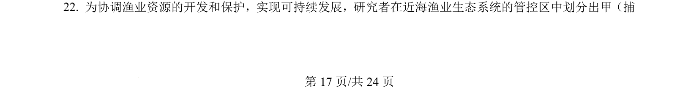
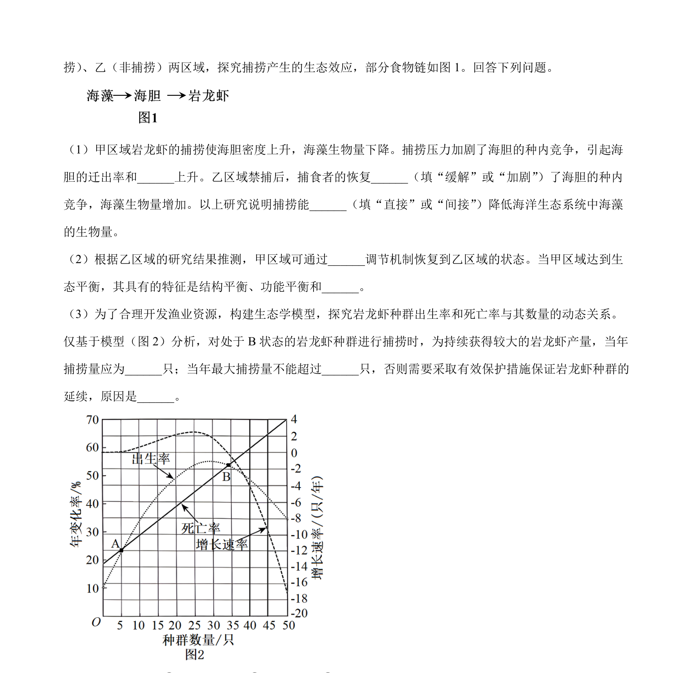
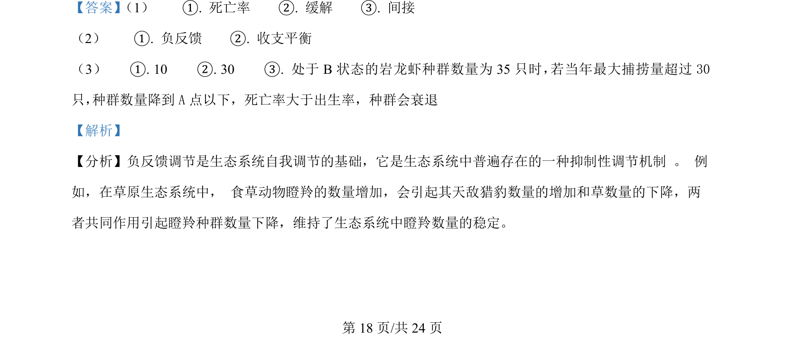
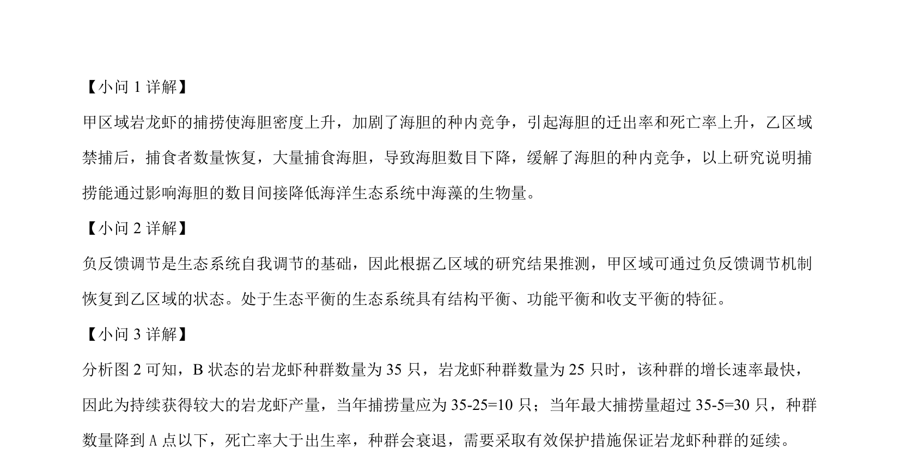

## 题面

## 摘要

本题考查近海渔业生态系统的资源管理与可持续发展策略。

## 关联考点

- [[020-生态系统|生态系统]]
- [[552-sustainable|可持续发展]]
- [[784-渔业资源管理|渔业资源管理]]

## 答案与解析

> 📄 原 PDF 第 17 页：`素材/真题/吉林/2008-2024·（吉林）生物高考真题/2024年高考生物试卷（辽宁）（解析卷）.pdf`
