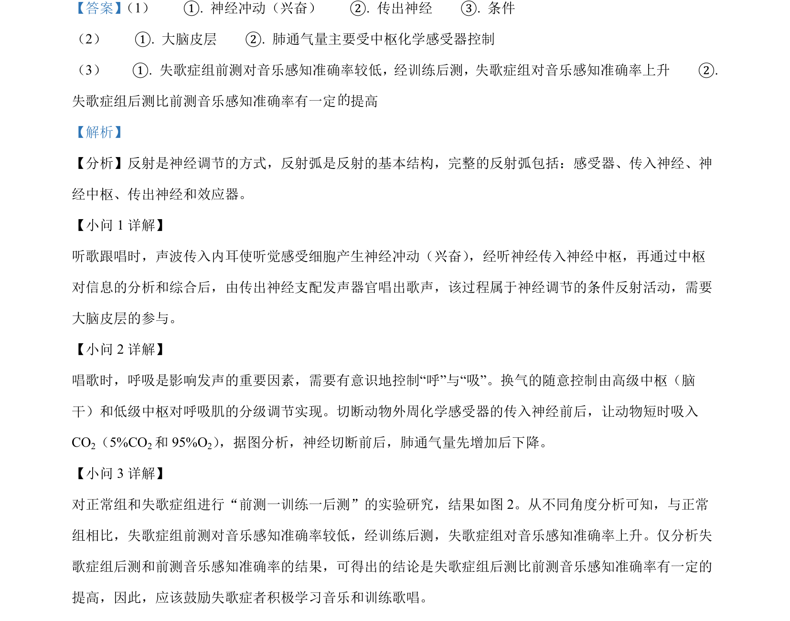

## 题面

## 摘要

本题通过听歌跟唱情景考查神经调节、反射类型、呼吸的神经与体液调节及失歌症实验数据分析。

## 关联考点

- [[324-神经调节|神经调节]]
- [[779-条件反射|条件反射]]
- [[330-体液调节|体液调节]]
- [[666-实验分析|实验分析]]

## 答案与解析

> 📄 原 PDF 第 19 页：`素材/真题/吉林/2008-2024·（吉林）生物高考真题/2024年高考生物试卷（辽宁）（解析卷）.pdf`
