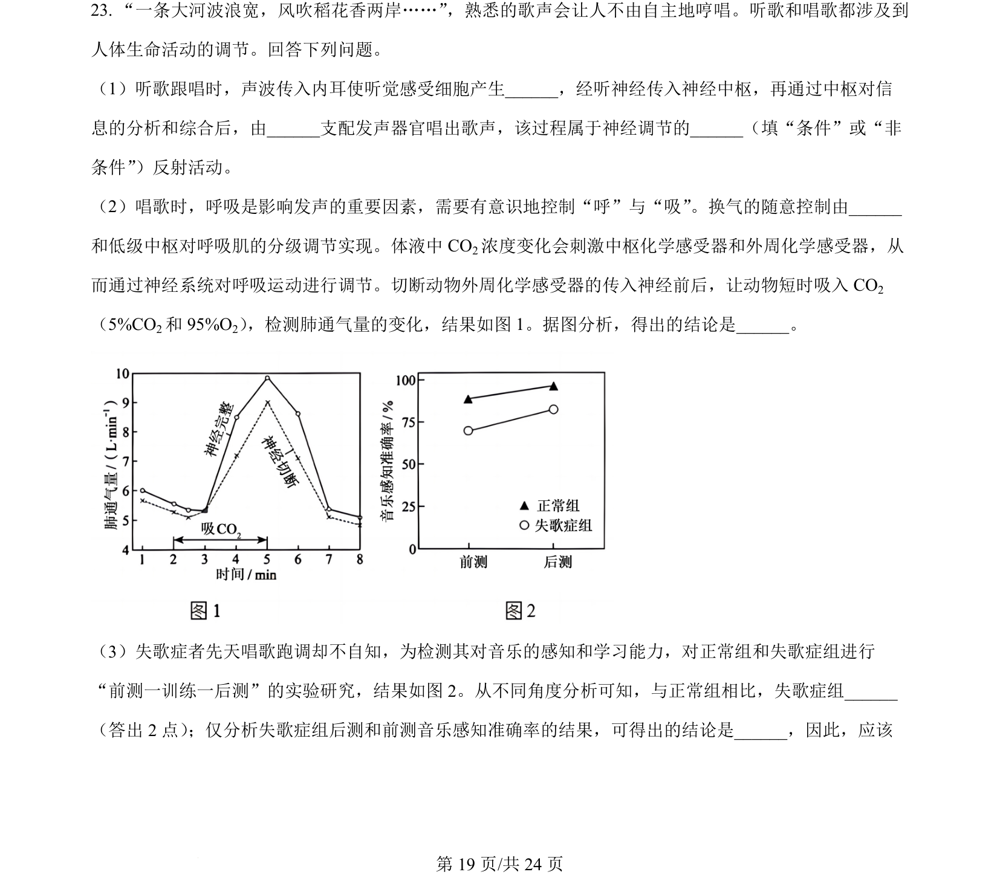
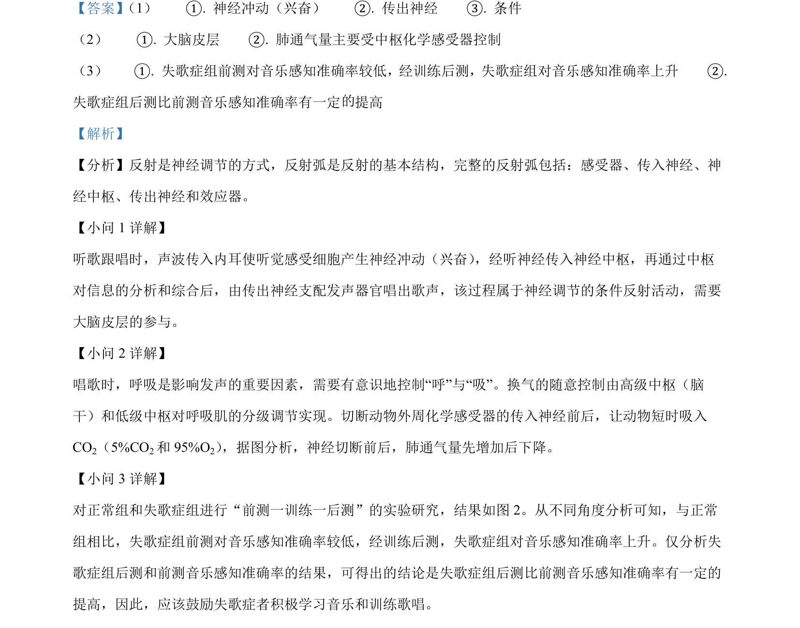

## 题面

## 摘要

本题通过听歌跟唱情景考查神经调节、反射类型、呼吸的神经与体液调节及失歌症实验数据分析。

## 关联考点

- [[324-神经调节|神经调节]]
- [[779-条件反射|条件反射]]
- [[330-体液调节|体液调节]]
- [[666-实验分析|实验分析]]

## 答案与解析

> 📄 原 PDF 第 19 页：`素材/真题/吉林/2008-2024·（吉林）生物高考真题/2024年高考生物试卷（辽宁）（解析卷）.pdf`

<!-- 题干文本-start -->
## 题干文本
23. “一条大河波浪宽，风吹稻花香两岸……”，熟悉的歌声会让人不由自主地哼唱。听歌和唱歌都涉及到
人体生命活动的调节。回答下列问题。
（1）听歌跟唱时，声波传入内耳使听觉感受细胞产生______，经听神经传入神经中枢，再通过中枢对信
息的分析和综合后，由______支配发声器官唱出歌声，该过程属于神经调节的______（填“条件”或“非
条件”）反射活动。
（2）唱歌时，呼吸是影响发声的重要因素，需要有意识地控制“呼”与“吸”。换气的随意控制由______
和低级中枢对呼吸肌的分级调节实现。体液中 CO2浓度变化会刺激中枢化学感受器和外周化学感受器，从
而通过神经系统对呼吸运动进行调节。切断动物外周化学感受器的传入神经前后，让动物短时吸入 CO2
（5%CO2和 95%O2） ，检测肺通气量的变化，结果如图1。据图分析，得出的结论是______。
（3）失歌症者先天唱歌跑调却不自知，为检测其对音乐的感知和学习能力，对正常组和失歌症组进行
“前测一训练一后测”的实验研究，结果如图 2。从不同角度分析可知，与正常组相比，失歌症组______
（答出 2 点） ；仅分析失歌症组后测和前测音乐感知准确率的结果，可得出的结论是______，因此，应该
<!-- 题干文本-end -->

<!-- 解析文本-start -->
## 解析文本

<!-- 解析文本-end -->
