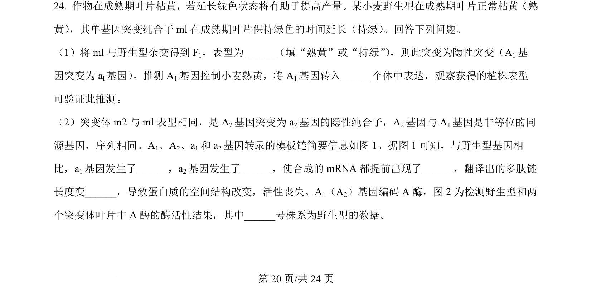
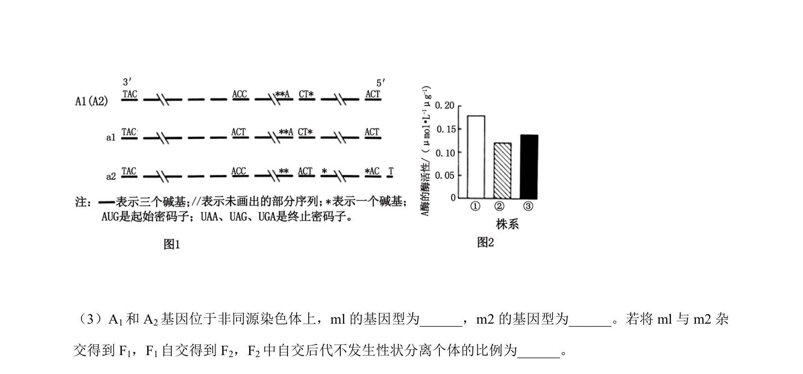
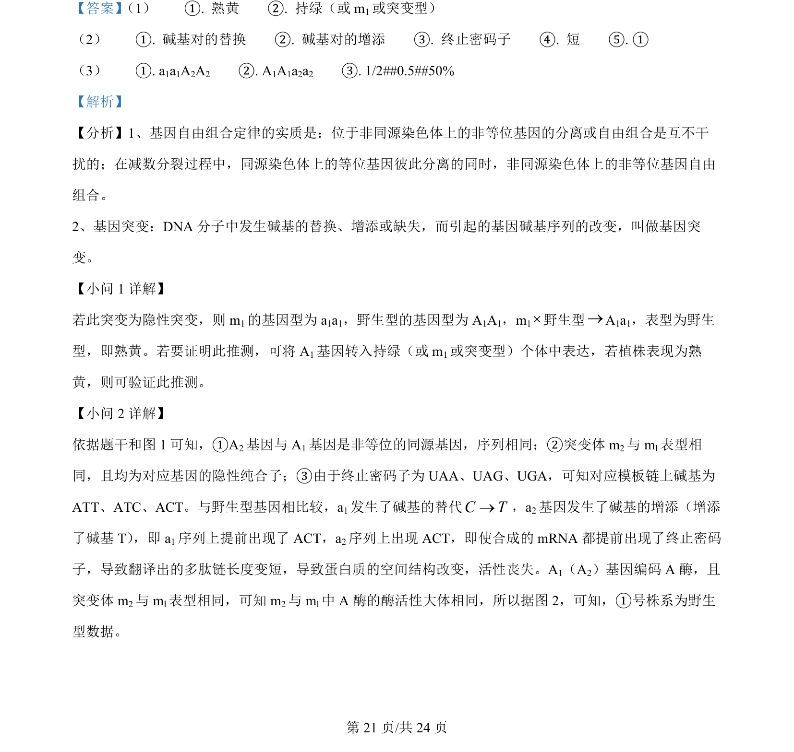
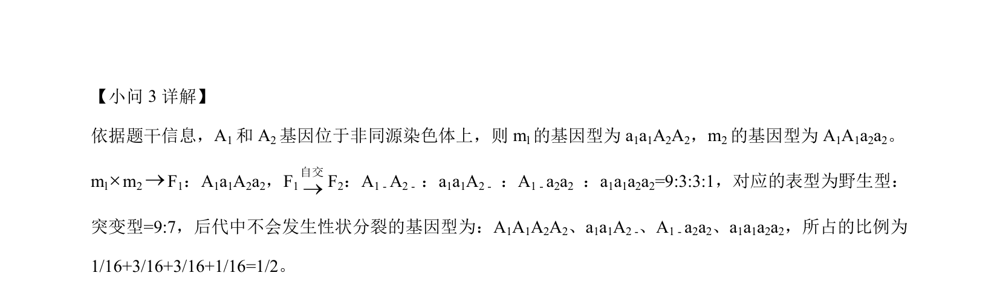

## 题面

## 摘要

该题以小麦叶片持绿与熟黄突变为背景，考查基因突变类型判断、转基因功能验证及基因结构变异与酶活性分析。

## 关联考点

- [[731-隐性突变|隐性突变]]
- [[301-基因突变|基因突变]]
- [[686-翻译提前终止|翻译提前终止]]
- [[726-酶活性测定|酶活性测定]]

## 答案与解析

> 📄 原 PDF 第 20 页：`素材/真题/吉林/2008-2024·（吉林）生物高考真题/2024年高考生物试卷（辽宁）（解析卷）.pdf`
