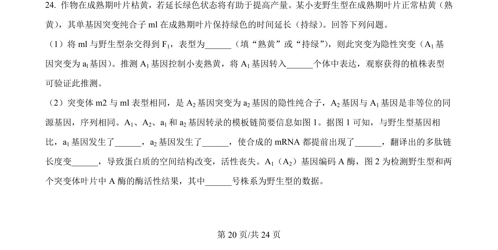
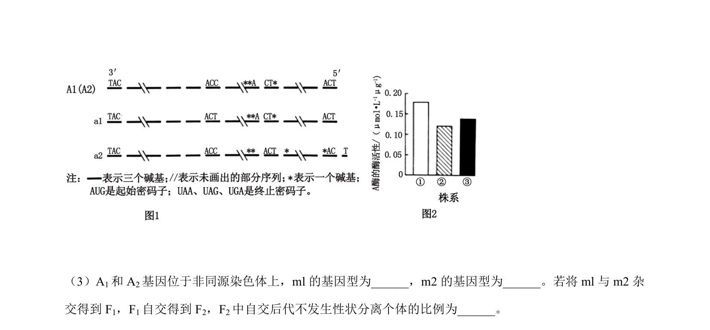
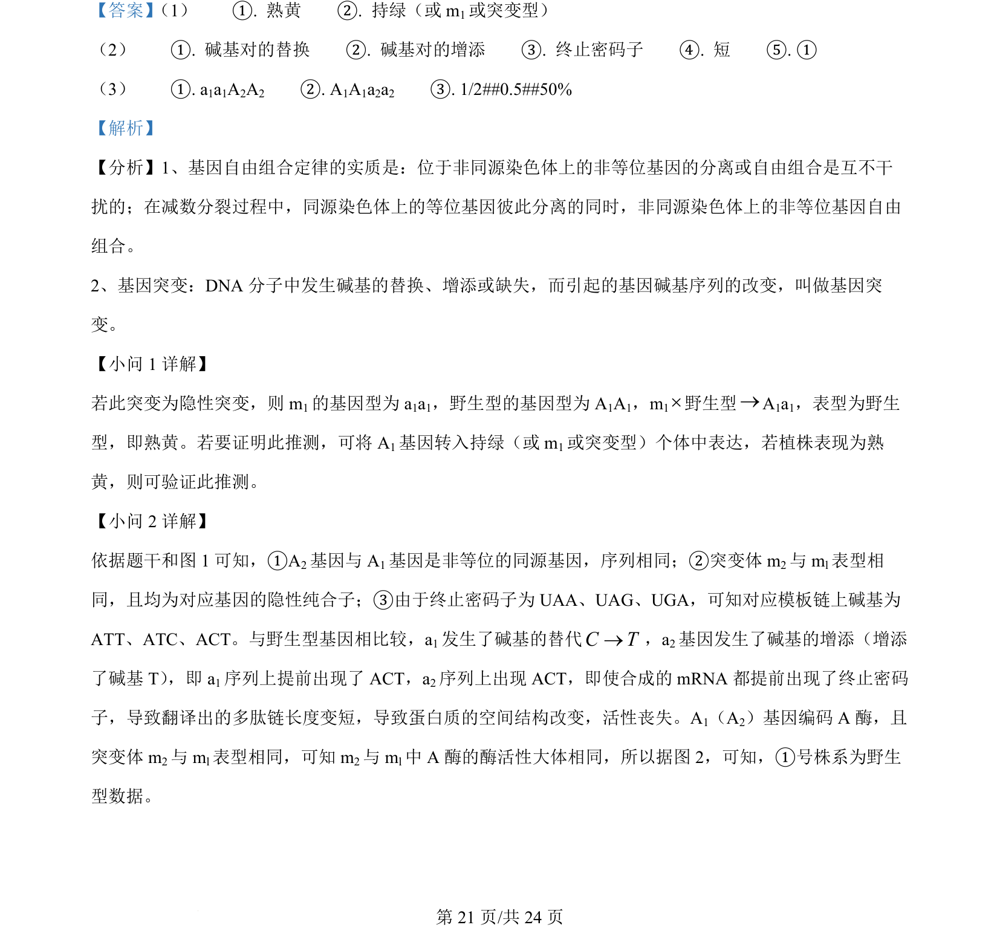
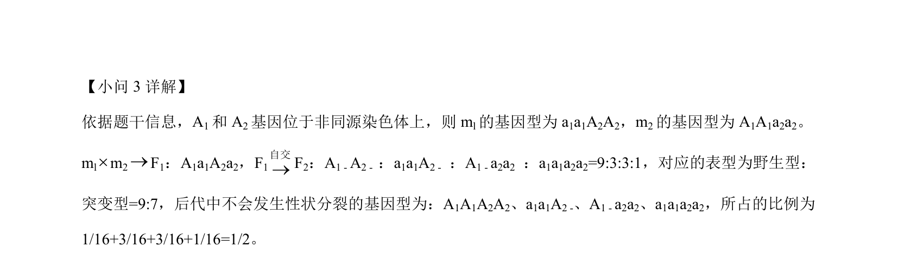

## 题面

## 摘要

该题以小麦叶片持绿与熟黄突变为背景，考查基因突变类型判断、转基因功能验证及基因结构变异与酶活性分析。

## 关联考点

- [[731-隐性突变|隐性突变]]
- [[301-基因突变|基因突变]]
- [[686-翻译提前终止|翻译提前终止]]
- [[726-酶活性测定|酶活性测定]]

## 答案与解析

> 📄 原 PDF 第 20 页：`素材/真题/吉林/2008-2024·（吉林）生物高考真题/2024年高考生物试卷（辽宁）（解析卷）.pdf`

<!-- 题干文本-start -->
## 题干文本
24. 作物在成熟期叶片枯黄，若延长绿色状态将有助于提高产量。某小麦野生型在成熟期叶片正常枯黄（熟
黄） ，其单基因突变纯合子ml在成熟期叶片保持绿色的时间延长（持绿） 。回答下列问题。
（1）将 ml与野生型杂交得到 F1，表型为______（填“熟黄”或“持绿”） ，则此突变为隐性突变（A1基
因突变为 al基因） 。推测A1基因控制小麦熟黄，将 A1基因转入______个体中表达，观察获得的植株表型
可验证此推测。
（2）突变体 m2与 ml表型相同，是 A2基因突变为 a2基因的隐性纯合子，A2基因与 A1基因是非等位的同
源基因，序列相同。A1、A2、a1和 a2基因转录的模板链简要信息如图 1。据图 1 可知，与野生型基因相
比，a1基因发生了______，a2基因发生了______，使合成的 mRNA 都提前出现了______，翻译出的多肽链
长度变______，导致蛋白质的空间结构改变，活性丧失。A1（A2）基因编码 A 酶，图 2 为检测野生型和两
个突变体叶片中 A 酶的酶活性结果，其中______号株系为野生型的数据。
的
<!-- 题干文本-end -->

<!-- 解析文本-start -->
## 解析文本

<!-- 解析文本-end -->
