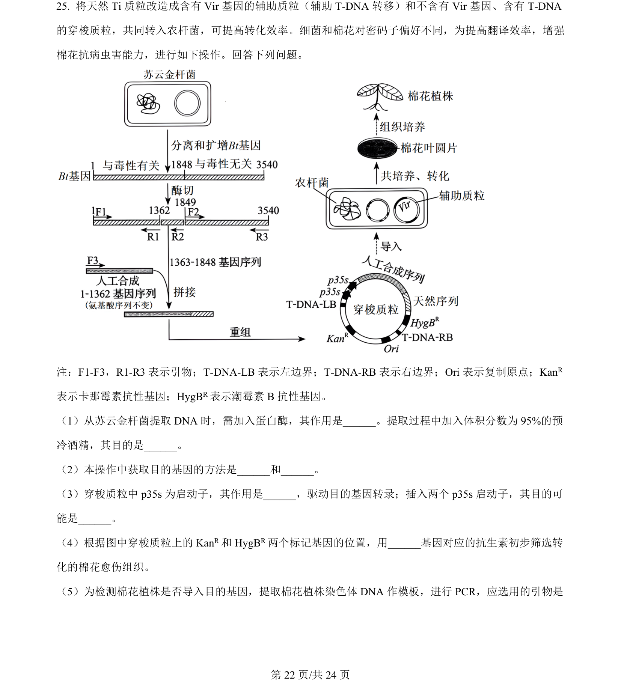
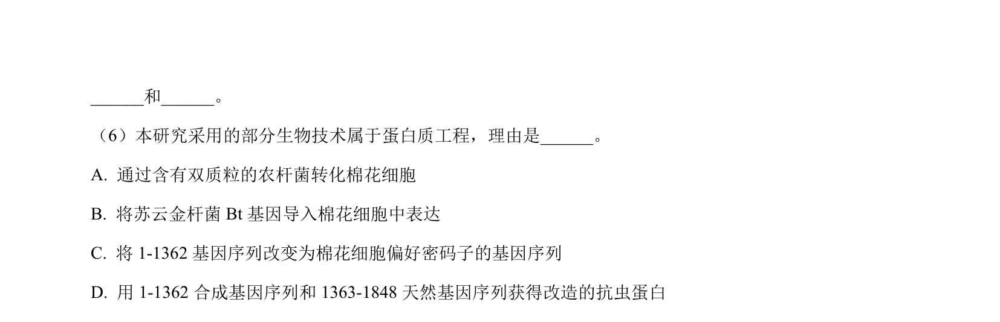
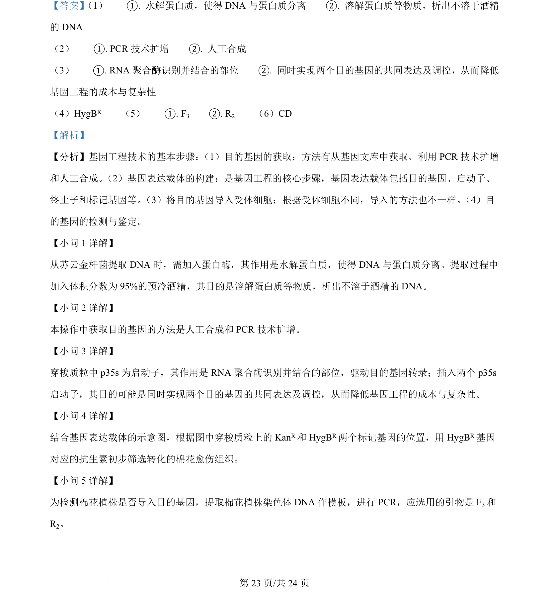
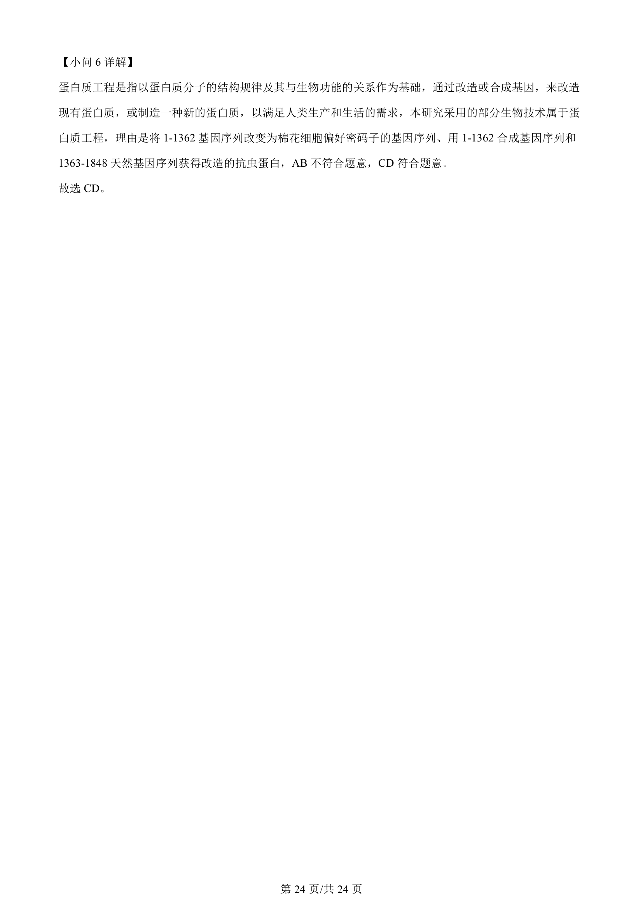

## 题面

## 摘要

本题以改造Ti质粒培育抗虫棉花为背景，考查基因工程操作流程及相关技术。

## 关联考点

- [[411-基因工程|基因工程]]
- [[目的基因获取]]
- [[410-PCR|PCR]]
- [[启动子]]
- [[标记基因]]

## 答案与解析

> 📄 原 PDF 第 22 页：`素材/真题/吉林/2008-2024·（吉林）生物高考真题/2024年高考生物试卷（辽宁）（解析卷）.pdf`
