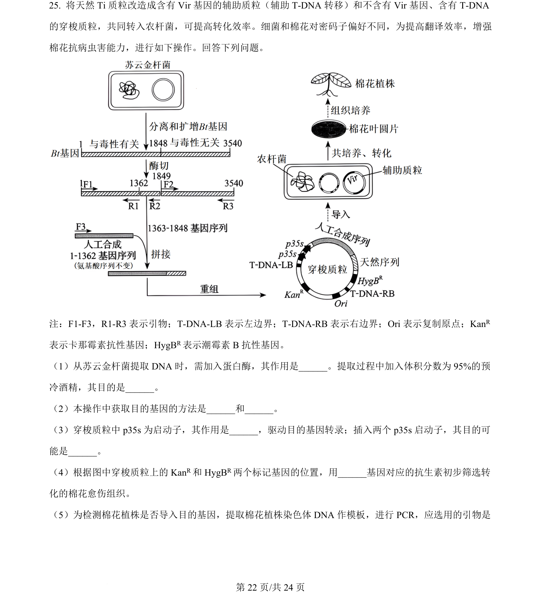
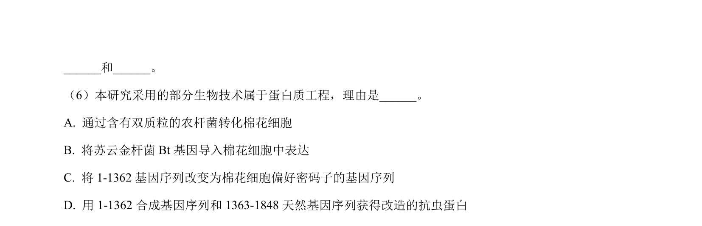
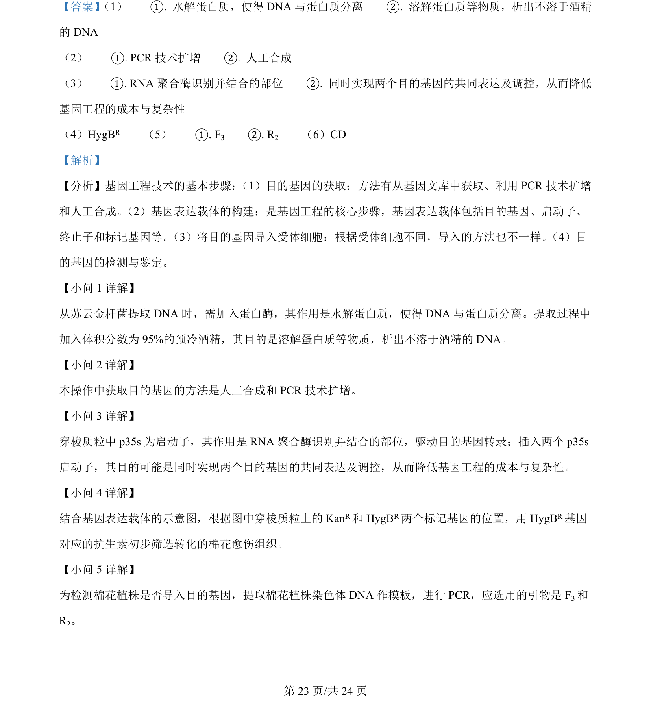

## 题面

## 摘要

本题以改造Ti质粒培育抗虫棉花为背景，考查基因工程操作流程及相关技术。

## 关联考点

- [[411-基因工程|基因工程]]
- [[859-目的基因的获取|目的基因获取]]
- [[410-PCR|PCR]]
- [[750-启动子|启动子]]
- [[617-标记基因|标记基因]]

## 答案与解析

> 📄 原 PDF 第 22 页：`素材/真题/吉林/2008-2024·（吉林）生物高考真题/2024年高考生物试卷（辽宁）（解析卷）.pdf`

<!-- 题干文本-start -->
## 题干文本
25. 将天然 Ti 质粒改造成含有 Vir 基因的辅助质粒（辅助 T-DNA 转移）和不含有 Vir 基因、含有 T-DNA
的穿梭质粒，共同转入农杆菌，可提高转化效率。细菌和棉花对密码子偏好不同，为提高翻译效率，增强
棉花抗病虫害能力，进行如下操作。回答下列问题。
注：F1-F3，R1-R3 表示引物；T-DNA-LB 表示左边界；T-DNA-RB 表示右边界；Ori 表示复制原点；KanR
表示卡那霉素抗性基因；HygBR表示潮霉素 B抗性基因。
（1）从苏云金杆菌提取 DNA 时，需加入蛋白酶，其作用是______。提取过程中加入体积分数为 95%的预
冷酒精，其目的是______。
（2）本操作中获取目的基因的方法是______和______。
（3）穿梭质粒中 p35s 为启动子，其作用是______，驱动目的基因转录；插入两个 p35s 启动子，其目的可
能是______。
（4）根据图中穿梭质粒上的 KanR和 HygBR两个标记基因的位置，用______基因对应的抗生素初步筛选转
化的棉花愈伤组织。
（5）为检测棉花植株是否导入目的基因，提取棉花植株染色体 DNA 作模板，进行 PCR，应选用的引物是
<!-- 题干文本-end -->

<!-- 解析文本-start -->
## 解析文本

<!-- 解析文本-end -->
