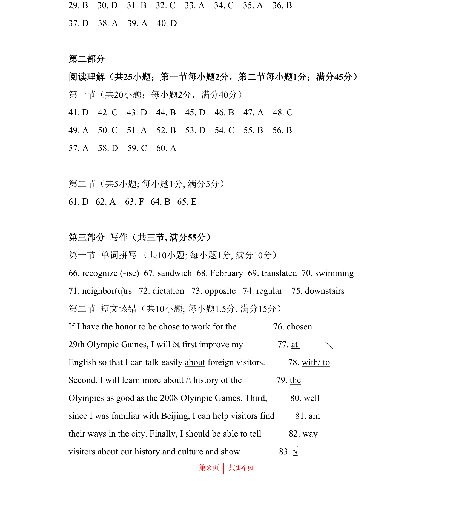
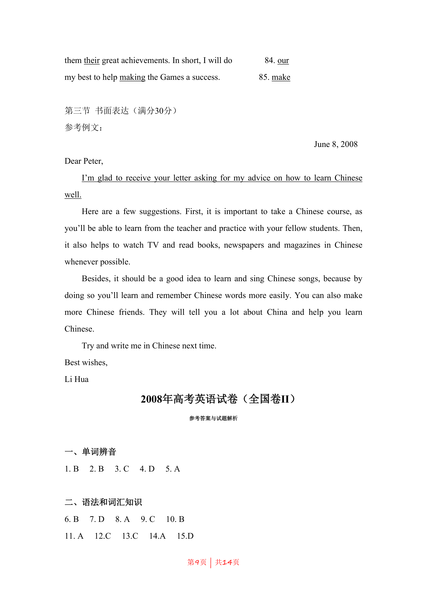
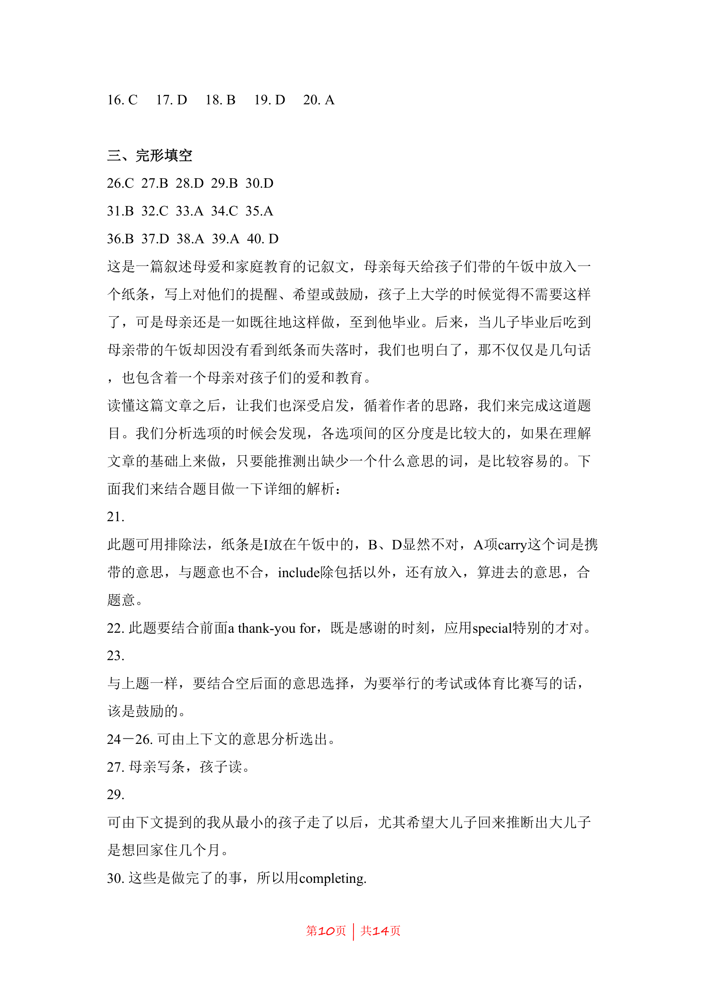
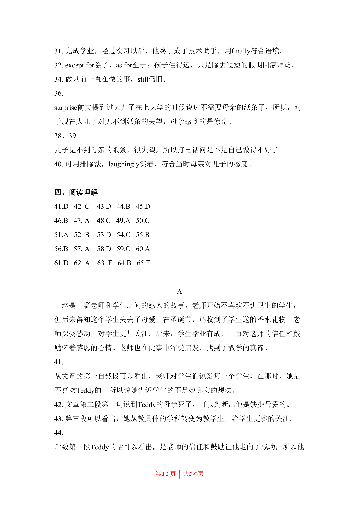
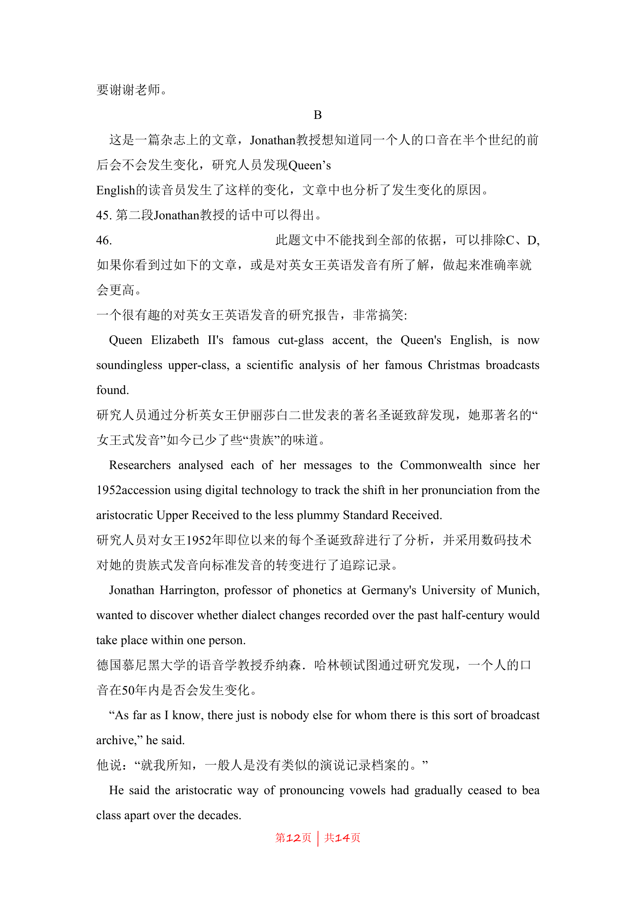
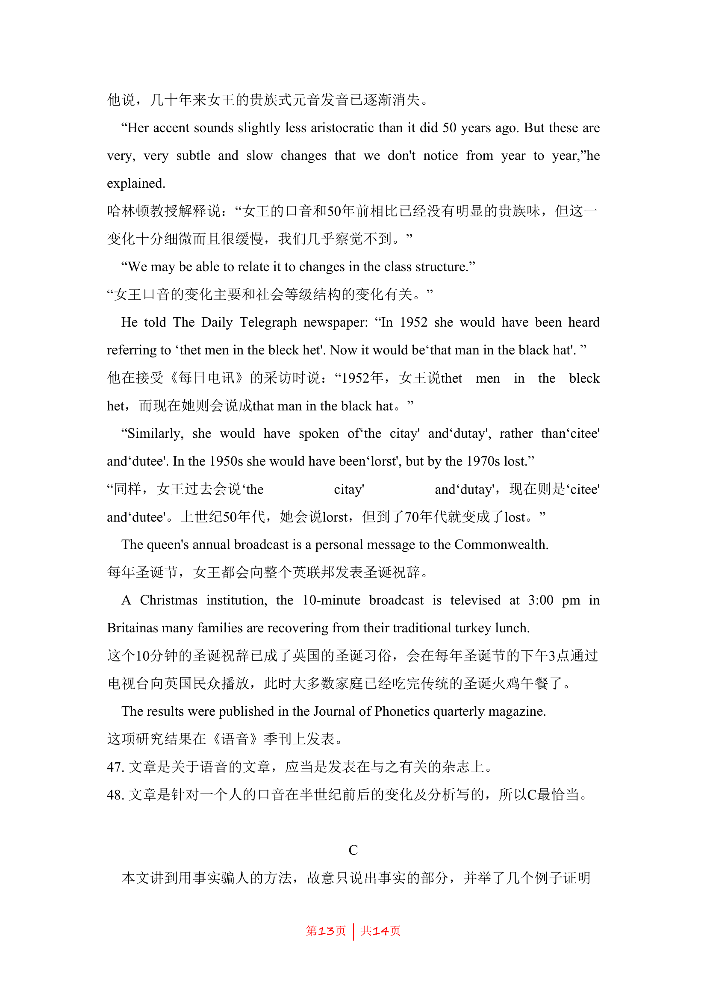
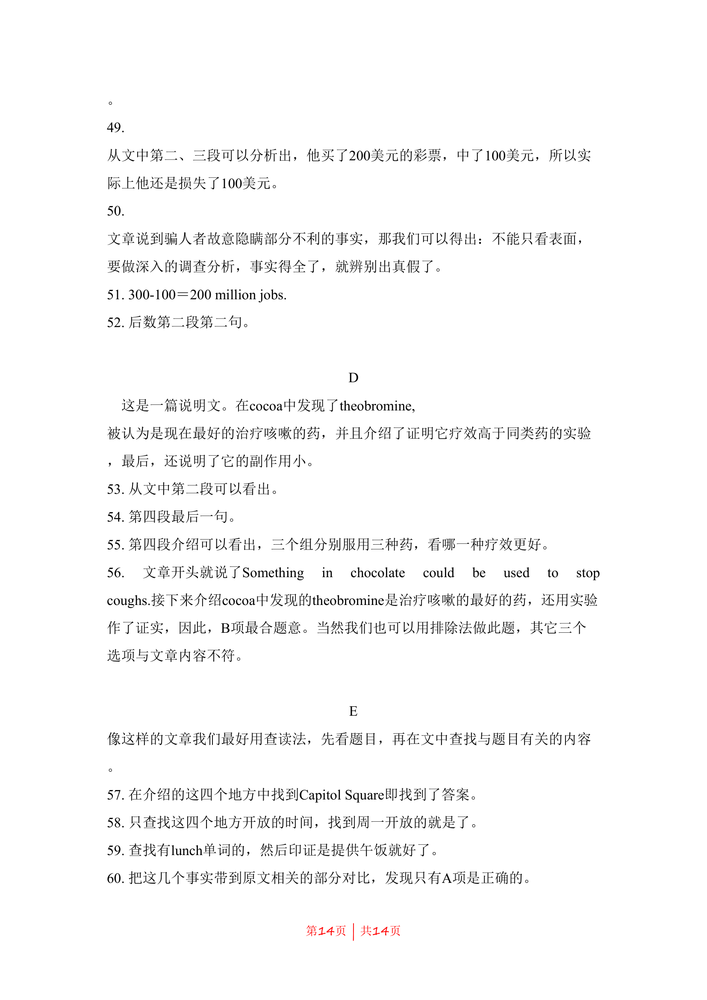

## 题面

## 摘要

本题为高考英语短文改错，考查学生在语篇中识别并修正动词非谓语、冠词、介词、形容词副词混用等常见错误的能力。

## 关联考点

- [[694-Verb form (past participle)|Verb form (past participle)]]
- [[775-冠词|Article]]
- [[685-Preposition|Preposition]]
- [[946-Adjective vs. Adverb|Adjective vs. Adverb]]

## 答案与解析

> 📄 原 PDF 第 8 页：`素材/真题/吉林/2008-2024·（吉林）英语高考真题/2008年高考英语试卷（全国Ⅱ卷）（解析卷）.pdf`
