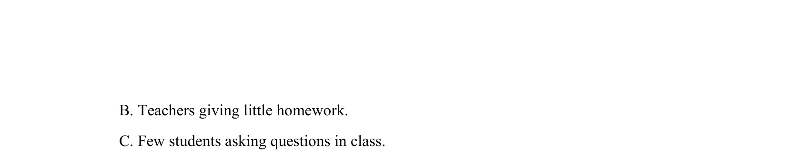

## 题面

## 摘要

该题考查听力中学生对学校生活细节的理解，需抓住惊讶原因。

## 关联考点

- [[796-听力细节理解|听力细节理解]]
- [[947-学校场景|学校场景]]
- [[750-交际用语|交际用语]]

## 答案与解析

> 📄 原 PDF 第 2 页：`素材/真题/吉林/2008-2024·（吉林）英语高考真题/2009年高考英语试卷（全国Ⅱ卷）（解析卷）.pdf`
