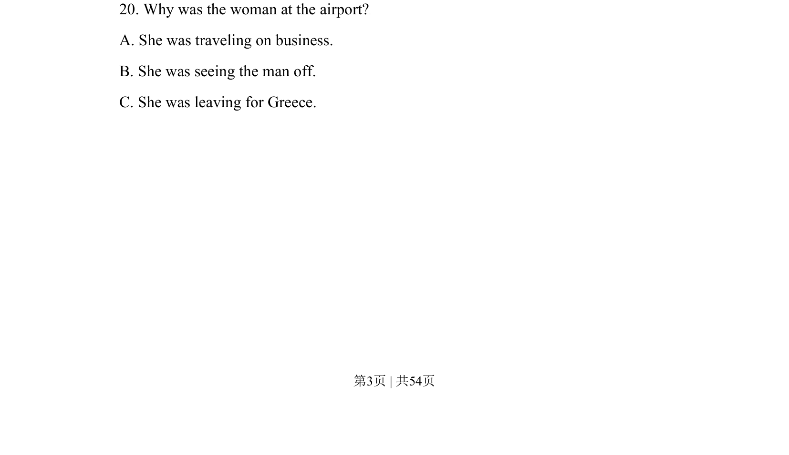
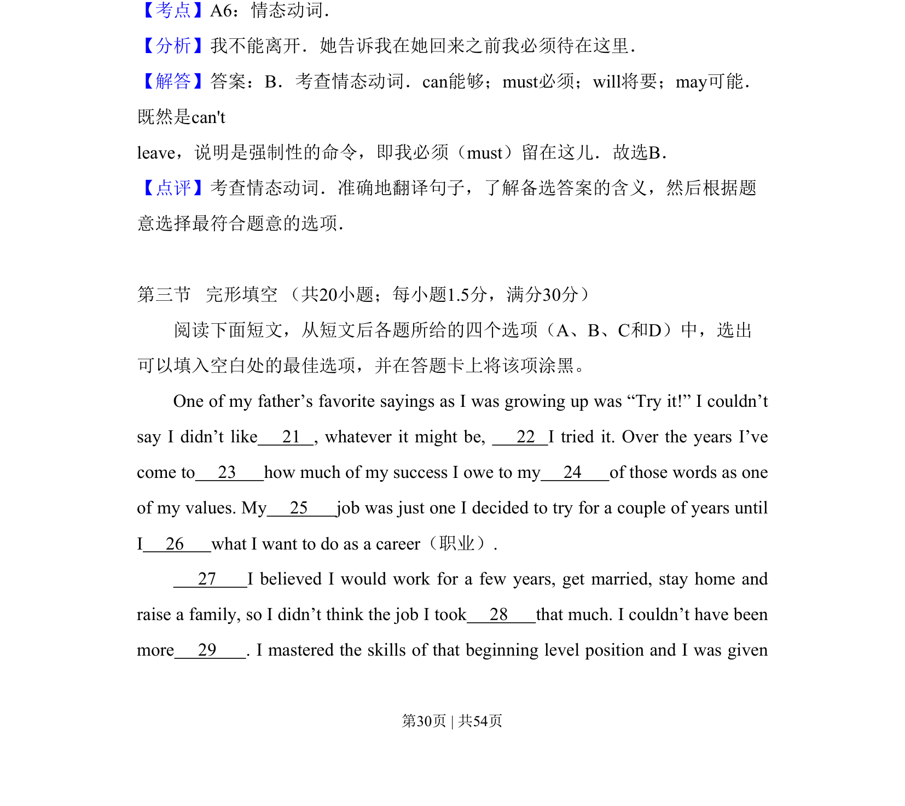
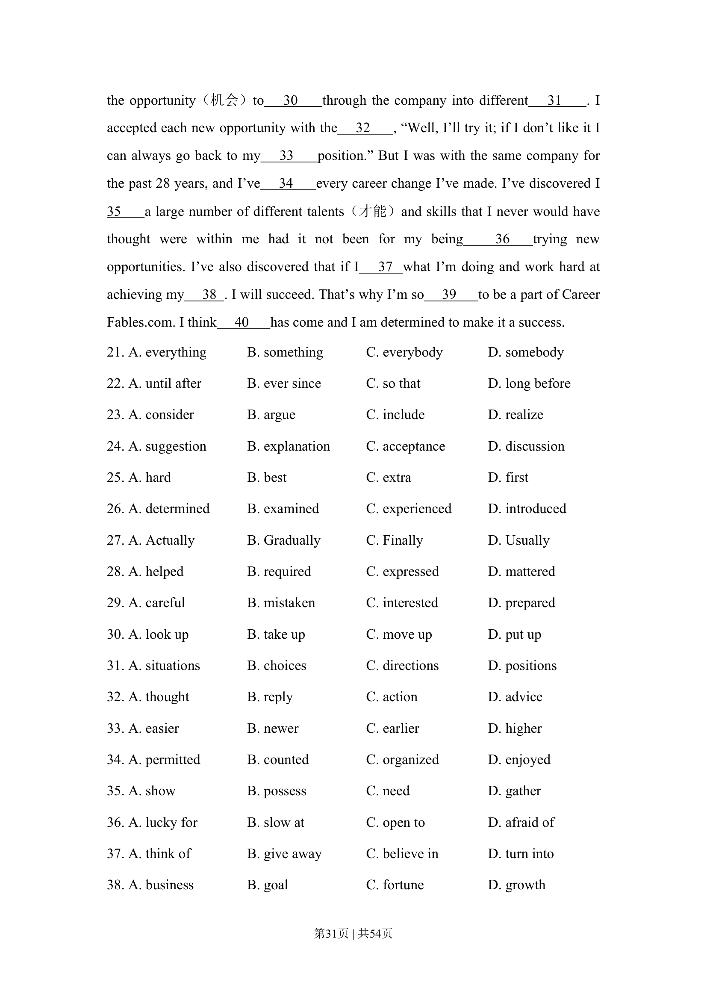
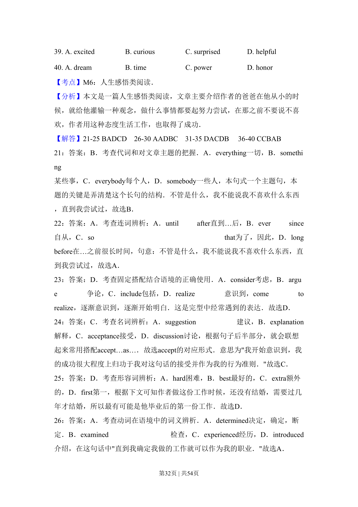
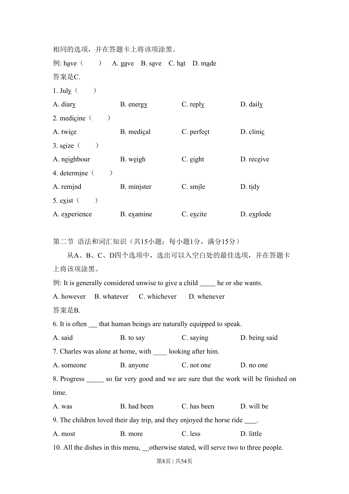
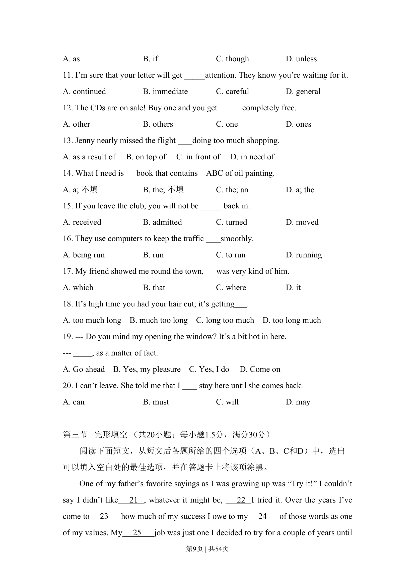

## 题面

## 摘要

本题考查听力对话中女士在机场的原因，需根据细节推断意图。

## 关联考点

- [[644-听力说明|听力理解]]
- [[882-细节辨认|细节辨认]]
- [[964-意图推断|意图推断]]

## 答案与解析

> 📄 原 PDF 第 3 页：`素材/真题/吉林/2008-2024·（吉林）英语高考真题/2009年高考英语试卷（全国Ⅱ卷）（解析卷）.pdf`
