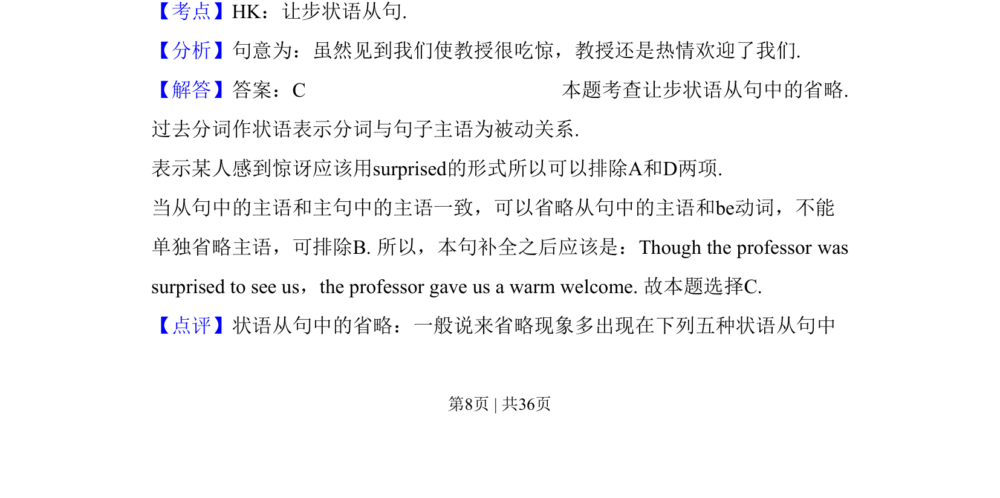
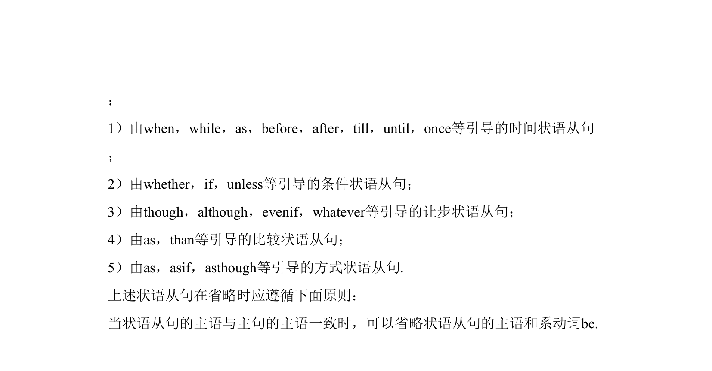

## 题面

## 摘要

考查让步状语从句的省略用法，需根据主被动关系选择过去分词形式。

## 关联考点

- [[440-状语从句-让步|让步状语从句]]
- [[870-省略|省略]]
- [[919-过去分词|过去分词]]

## 答案与解析

> 📄 原 PDF 第 8 页：`素材/真题/吉林/2008-2024·（吉林）英语高考真题/2010年高考英语试卷（新课标Ⅱ卷）（解析卷）.pdf`
