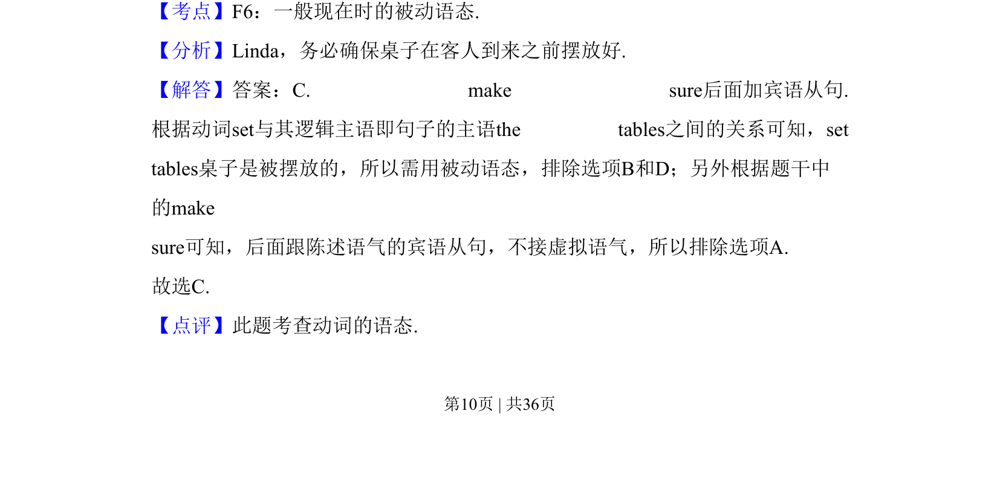
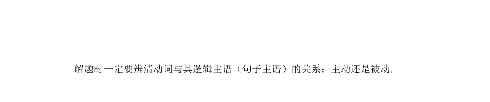

## 题面

## 摘要

本题考查一般现在时被动语态在宾语从句中的应用。

## 关联考点

- [[734-一般现在时被动语态|一般现在时被动语态]]
- [[315-宾语从句-初中|宾语从句]]
- [[912-语态|语态]]

## 答案与解析

> 📄 原 PDF 第 10 页：`素材/真题/吉林/2008-2024·（吉林）英语高考真题/2010年高考英语试卷（新课标Ⅱ卷）（解析卷）.pdf`
