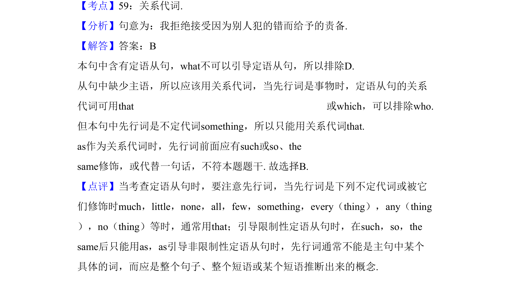

## 题面

## 摘要

该题考查定语从句中关系代词的选用，尤其当先行词为不定代词时须用that。

## 关联考点

- [[314-定语从句-初中入门|定语从句]]
- [[773-关系代词|关系代词]]
- [[739-不定代词|不定代词]]

## 答案与解析

> 📄 原 PDF 第 11 页：`素材/真题/吉林/2008-2024·（吉林）英语高考真题/2010年高考英语试卷（新课标Ⅱ卷）（解析卷）.pdf`
