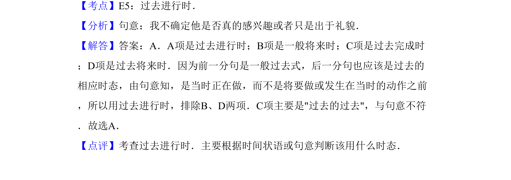

## 题面

## 摘要

考查过去进行时的用法，需结合语境判断时态。

## 关联考点

- [[226-What were you doing when...？|过去进行时]]
- [[054-一般过去时|一般过去时]]

## 答案与解析

> 📄 原 PDF 第 9 页：`素材/真题/吉林/2008-2024·（吉林）英语高考真题/2011年高考英语试卷（新课标）（解析卷）.pdf`
