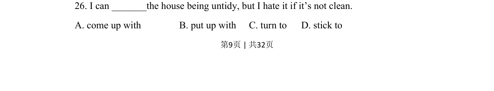
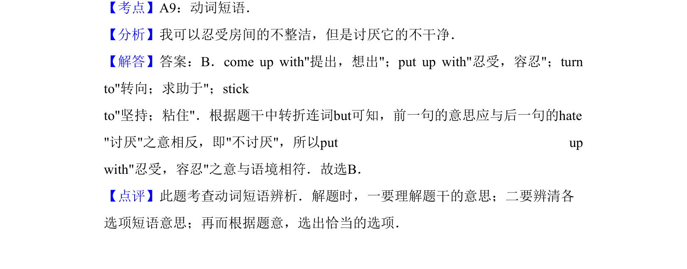

## 题面

## 摘要

该题考查动词短语 put up with 表示“容忍”的用法，通过语境区分四个短语含义。

## 关联考点

- [[779-动词短语辨析|动词短语辨析]]
- [[908-语境理解|语境理解]]

## 答案与解析

> 📄 原 PDF 第 9 页：`素材/真题/吉林/2008-2024·（吉林）英语高考真题/2011年高考英语试卷（新课标）（解析卷）.pdf`
