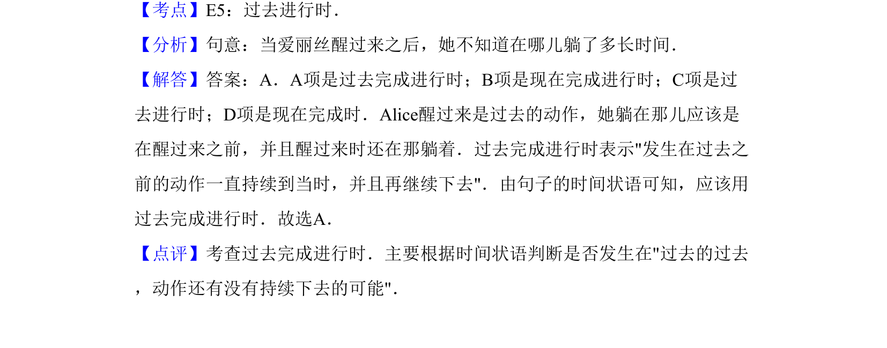

## 题面

## 摘要

该题考查过去完成进行时的用法，需根据时间状语判断动作是否发生在过去的过去并持续到当时。

## 关联考点

- [[920-过去完成进行时|过去完成进行时]]
- [[842-时态判断|时态判断]]
- [[849-时间状语|时间状语]]

## 答案与解析

> 📄 原 PDF 第 11 页：`素材/真题/吉林/2008-2024·（吉林）英语高考真题/2011年高考英语试卷（新课标）（解析卷）.pdf`
