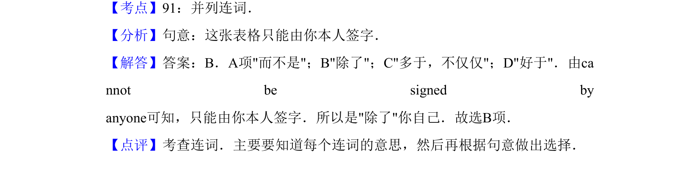

## 题面

## 摘要

这张表格只能由你本人签字，考查 other than 表示“除了”的用法。

## 关联考点

- [[815-并列连词|并列连词]]
- [[721-other than|other than]]
- [[903-语义辨析|语义辨析]]

## 答案与解析

> 📄 原 PDF 第 11 页：`素材/真题/吉林/2008-2024·（吉林）英语高考真题/2011年高考英语试卷（新课标）（解析卷）.pdf`
