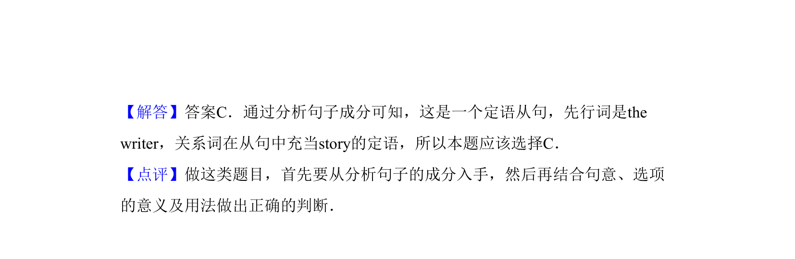

## 题面

## 摘要

单项选择，考查定语从句引导词辨析（that/which/whose/what），句意为'作品最具想象力的作者获奖'。

## 关联考点

- [[单项选择]]
- [[语法]]
- [[314-定语从句-初中入门|定语从句]]

## 答案与解析

> 📄 原 PDF 第 11 页：`素材/真题/吉林/2008-2024·（吉林）英语高考真题/2011年高考英语试卷（新课标）（解析卷）.pdf`
